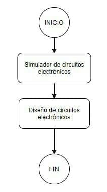

# Herramientas de diseño

Para este proceso se requieren herramientas como las mostradas en la siguiente figura.

## Simulador de circuitos electrónicos

Se puede optar por las siguientes herramientas:

### Qucs

Es un simulador de circuitos electrónicos de código abierto cuya licencia de distribución es GNU GPL. Posee la capacidad de elaborar un circuito con una interfaz gráfica de usuario y simular el comportamiento del circuito en modo de gran señal, pequeña señal y con ruido eléctrico. Soporta además, la simulación de circuitos digitales usando VHDL y/o Verilog.

### gEDA

Es un entorno de software para la automatización de diseño electrónico, usado para el diseño de esquemas eléctricos, circuitos impresos y simulación.

### PCB EveryCircuit

En la plataforma Android tambien se consigue herramientas para la simulación de sistemas digitales, en la que se puede destacar **PCB EveryCircuit**

## Diseño de circuitos digitales

### KiCad EDA
Es un entorno de software usado para el diseño de circuitos eléctricos, muy flexible y adaptable, en el que se pueden crear y editar un gran número de componentes y usarlos en Eeschema. KiCad permite el diseño de circuitos impresos modernos de forma sencilla e intuitiva. Además, en Pcbnew, los circuitos se pueden diseñar con múltiples capas y ser visualizados en 3D.

