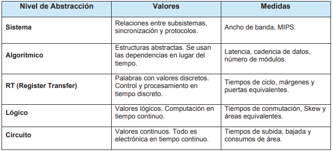

# Dominio descriptivo y metodología de diseño

--{{0}}--
En este apartado se describira el dominio descriptivo clasificados por su nivel de abstracción y las metodologías de diseño indispensables para el desarrollo de software.

 {{1}}
********************************************************************************

Dominio descriptivo
       
                           --{{1}}--

Existen varios estilos para la descripción de diseños. Estos, denominados dominios descriptivos, son distintos en cuanto al nivel de abstracción que manejan, y son: 

1. Dominio de Comportamiento.

El dominio de Comportamiento o algorítmico es el nivel de abstracción más elevado. Cuando se describe usando este nivel de abstracción, el circuito se modela en términos de su funcionalidad, sin preocuparse de los componentes internos del mismo o de qué forma física se llevará a cabo esta funcionalidad.

2. Dominio de Flujo de Datos (RTL).

El dominio de Flujo de Datos describe el circuito en términos de cómo los datos se mueven a través del sistema y la forma en que la información fluye a través de los registros del circuito. El diseñador toma en cuenta las distintas señales que interactúan en un circuito, así como su comportamiento por medio de ecuaciones lógicas y sentencias de asignación. Este modelo es comúnmente llamado Transferencia Lógica de Registros (RTL, Register Transfer Logic). Es un nivel intermedio que permite simplificar la lógica combinacional, mientras que las partes más importantes del circuito, los registros, son especificados de acuerdo a la función a modelar.

3. Dominio Físico.

El dominio Físico, o nivel lógico, se usa para describir circuitos en términos de sus componentes. Puede ser usado para crear una descripción de bajo nivel, como la descripción a nivel de transistor, o una descripción a nivel de diagrama de bloques. El diseñador emplea los recursos que el lenguaje proporciona para describir las interconexiones entre los distintos componentes de un circuito. 

* bibing: http://bibing.us.es/proyectos/abreproy/12112/fichero/Documento_por_capitulos%252F2_Cap%C3%ADtulo_2.pdf

dominio-descriptivo.png

Como se puede observar, cada uno de los niveles de abstracción se ocupa de unos determinados valores, que posteriormente las herramientas de síntesis y optimización se encargarán de ajustar y optimizar, usando algoritmos de iteración sobre cada uno de los elementos. 

Los niveles de abstracción, se describen por medio de la siguiente tabla:

****************************************************************************

 {{2}}
****************************************************************************

Metodologías de diseño  
                           --{{2}}--

El diseño de software es un proceso para conceptualizar los requisitos de software en la implementación de software. El diseño de software toma los requisitos del usuario como desafíos y trata de encontrar una solución óptima. Mientras se conceptualiza el software, se elabora un plan para encontrar el mejor diseño posible para implementar la solución deseada.

**1. Metodología ágil**

El desarrollo ágil de software envuelve un enfoque para la toma de decisiones en los proyectos de software, que se refiere a métodos de ingeniería del software basados en el desarrollo iterativo e incremental, donde los requisitos y soluciones evolucionan con el tiempo según la necesidad del proyecto.

* Wikipedia: https://es.wikipedia.org/wiki/Desarrollo_%C3%A1gil_de_software

* Fuente: https://excelencemanagement.wordpress.com/2021/03/01/metodologias-agiles-cuestion-de-principios-y-de-valores/

**2. Modularidad**

La modularidad es la capacidad que tiene un sistema de ser estudiado, visto o entendido como la unión de varias partes que interactúan entre sí y que trabajan para alcanzar un objetivo común, realizando cada una de ellas una tarea necesaria para la consecución de dicho objetivo. Cada una de esas partes en que se encuentre dividido el sistema recibe el nombre de módulo. Idealmente un módulo debe poder cumplir las condiciones de caja negra, es decir, ser independiente del resto de los módulos y comunicarse con ellos (con todos o sólo con una parte) a través de unas entradas y salidas bien definidas.

* Fuente: https://www.fing.edu.uy/tecnoinf/maldonado/cursos/eda/material/teo/EDA-teorico2.pdf

****************************************************************************

Metodología Top-Down

El diseño de arriba hacia abajo toma todo el sistema de software como una entidad y luego lo descompone para lograr más de un subsistema o componente basado en algunas características. Cada subsistema o componente se trata como un sistema y se descompone más adelante. Este proceso se mantiene en ejecución hasta que se alcanza el nivel más bajo del sistema en la jerarquía descendente.

 {{2}}
****************************************************************************

Diseño de un sistema embebido
                           --{{2}}--

Especificación del sistema
==========================

El proceso de diseño de un sistema embebido comienza con la *especificación del sistema*, en este punto se describe la funcionalidad y se definen las restricciones mecanicas, 
electricas y economicas del sistema. Esta especificaciOn debe ser muy general y no deben existir dependencias tecnologicas de ningun tipo, se suelen utilizar lenguajes de alto 
nivel, como Unified Modeling Language (UML), Modeling and Analysis of Real-Time and Embedded Systems (MARTE) C++, System-C, Spec-C. La especificacion puede ser verificada a traves 
de una serie de pasos de analisis cuyo objetivo es determinar la validez de los algoritmos seleccionados, por ejemplo, determinar si el algoritmo converge o si sus resultados 
satisfacen las especificaciones. Desde el punto de vista de la re-utilizacion, algunas partes del funcionamiento global pueden tomarse de una librerfa de algoritmos existentes. 

Modelamiento
============

Una vez definidas las especificaciones del sistema, se debe realizar un modelamiento que permita extraer de estas su funcionalidad. El modelamiento es crucial en el diseño ya que 
de el depende el paso exitoso de la especificación a la implementación. Es importante definir que modelo matemático debe soportar el entorno de diseño; cada modelo posee 
propiedades matemáticas que pueden explotarse de forma eficiente para responder preguntas sobre la funcionalidad del sistema sin llevar a cabo dispendiosas tareas de verificación. Todo modelo obtenido debe ser verificado para comprobar que cumple con las restricciones del sistema. 

Arquitectura
============

Una vez se ha obtenido el modelo del sistema se procede a determinar su arquitectura, esto es, el numero y tipo de componentes y su inter-conexión; este paso no es mas que una 
exploración del espacio de diseño en búsqueda de soluciones que permitan la implementación de una funcionalidad dada, y puede realizarse con varios criterios en mente: costos, 
confiabilidad y viabilidad comercial. 

Asignación de funciones
=======================

Utilizando como base la arquitectura obtenida en el paso anterior las tareas del modelo del sistemas son implementadas en los componentes; esto es, asignación de funciones a los 
componentes de la arquitectura. Existen dos opciones a la hora de implementar las tareas o procesos: 

1. Implementación software: La tarea se va a ejecutar en un micro-procesador, micro-controlador o DSP. 
2. Implementación hardware: La tarea se va a ejecutar en un sistema digital dedicado ASIC o PLD. 

Para cumplir las especificaciones del sistema algunas tareas deben ser implementadas en hardware, esto con el fin de no ocupar al procesador en tareas cíclicas o que requieran 
mucho poder computacional, un ejemplo típico de estas tareas es la generación de bases de tiempos o la implementación de protocolos de comunicación. La decisión de que tareas se
implementan en SW y que tareas se implementan en HW recibe el nombre de *particionamiento*; esta selección depende fuertemente de restricciones económicas y temporales. 

Las tareas de software deben compartir los recursos que existan en el sistema (procesador y memoria), por lo tanto se deben tomar decisiones sobre el orden de ejecución y la 
prioridad de estas. Este proceso recibe el nombre de *planificación*. En este punto del diseño el modelo debe incluir información sobre el mapeo, el particionamiento y la 
planificación del sistema. 

Implementación del modelo
=========================

Las siguientes fases corresponden a la implementación del modelo, para esto las tareas hardware deben ser llevadas al dispositivo elegido (ASIC, FPGA, micro-controlador, 
micro-procesador, DSP) y se debe obtener el *archivo binario* con las instrucciones que implementan la funcionalidad de las tareas software y un *archivo de configuración* para 
implementarla funcionalidad de las tareas hardware en el PLD, este proceso recibe el nombre de *síntesis* HW y SW respectivamente, así mismo se deben sintetizar los mecanismos 
de comunicación entre las tareas hardware y software. 

Prototipado
===========

El proceso de prototipado consiste en la realización física del sistema, finalmente el sistema físico debe someterse a pruebas para verificar que cumple con las especificaciones
iniciales. Como puede verse en el flujo de diseño existen realimentaciones, estas permiten depurar el resultado de pasos anteriores en el caso de no cumplirse con las 
especificaciones iniciales. 

Análisis...
===========

****************************************************************************

