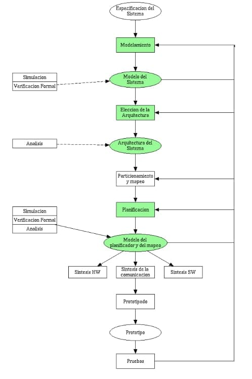

# Diseño de un sistema embebido

## Especificación del sistema

El proceso de diseño de un sistema embebido comienza con la *especificación del sistema*, en este punto se describe la funcionalidad y se definen las restricciones mecanicas, 
electricas y economicas del sistema. Esta especificaciOn debe ser muy general y no deben existir dependencias tecnologicas de ningun tipo, se suelen utilizar lenguajes de alto 
nivel, como Unified Modeling Language (UML), Modeling and Analysis of Real-Time and Embedded Systems (MARTE) C++, System-C, Spec-C. La especificacion puede ser verificada a traves 
de una serie de pasos de analisis cuyo objetivo es determinar la validez de los algoritmos seleccionados, por ejemplo, determinar si el algoritmo converge o si sus resultados 
satisfacen las especificaciones. Desde el punto de vista de la re-utilizacion, algunas partes del funcionamiento global pueden tomarse de una librerfa de algoritmos existentes. 

## Modelamiento

Una vez definidas las especificaciones del sistema, se debe realizar un modelamiento que permita extraer de estas su funcionalidad. El modelamiento es crucial en el diseño ya que 
de el depende el paso exitoso de la especificación a la implementación. Es importante definir que modelo matemático debe soportar el entorno de diseño; cada modelo posee 
propiedades matemáticas que pueden explotarse de forma eficiente para responder preguntas sobre la funcionalidad del sistema sin llevar a cabo dispendiosas tareas de verificación. Todo modelo obtenido debe ser verificado para comprobar que cumple con las restricciones del sistema. 

## Arquitectura

Una vez se ha obtenido el modelo del sistema se procede a determinar su arquitectura, esto es, el numero y tipo de componentes y su inter-conexión; este paso no es mas que una 
exploración del espacio de diseño en búsqueda de soluciones que permitan la implementación de una funcionalidad dada, y puede realizarse con varios criterios en mente: costos, 
confiabilidad y viabilidad comercial. 

## Asignación de funciones

Utilizando como base la arquitectura obtenida en el paso anterior las tareas del modelo del sistemas son implementadas en los componentes; esto es, asignación de funciones a los 
componentes de la arquitectura. Existen dos opciones a la hora de implementar las tareas o procesos: 

1. Implementación software: La tarea se va a ejecutar en un micro-procesador, micro-controlador o DSP. 
2. Implementación hardware: La tarea se va a ejecutar en un sistema digital dedicado ASIC o PLD. 

Para cumplir las especificaciones del sistema algunas tareas deben ser implementadas en hardware, esto con el fin de no ocupar al procesador en tareas cíclicas o que requieran 
mucho poder computacional, un ejemplo típico de estas tareas es la generación de bases de tiempos o la implementación de protocolos de comunicación. La decisión de que tareas se
implementan en SW y que tareas se implementan en HW recibe el nombre de *particionamiento*; esta selección depende fuertemente de restricciones económicas y temporales. 

Las tareas de software deben compartir los recursos que existan en el sistema (procesador y memoria), por lo tanto se deben tomar decisiones sobre el orden de ejecución y la 
prioridad de estas. Este proceso recibe el nombre de *planificación*. En este punto del diseño el modelo debe incluir información sobre el mapeo, el particionamiento y la 
planificación del sistema. 

## Implementación del modelo

Las siguientes fases corresponden a la implementación del modelo, para esto las tareas hardware deben ser llevadas al dispositivo elegido (ASIC, FPGA, micro-controlador, 
micro-procesador, DSP) y se debe obtener el *archivo binario* con las instrucciones que implementan la funcionalidad de las tareas software y un *archivo de configuración* para 
implementarla funcionalidad de las tareas hardware en el PLD, este proceso recibe el nombre de *síntesis* HW y SW respectivamente, así mismo se deben sintetizar los mecanismos 
de comunicación entre las tareas hardware y software. 

## Prototipado

El proceso de prototipado consiste en la realización física del sistema, finalmente el sistema físico debe someterse a pruebas para verificar que cumple con las especificaciones
iniciales. Como puede verse en el flujo de diseño existen realimentaciones, estas permiten depurar el resultado de pasos anteriores en el caso de no cumplirse con las 
especificaciones iniciales. 

