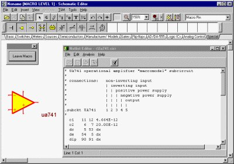

<!--

author: Carlos Camargo, Johnny Cubides

comment: Sesión

script:   https://cdn.jsdelivr.net/chartist.js/latest/chartist.min.js
          https://felixhao28.github.io/JSCPP/dist/JSCPP.es5.min.js

link: https://cdn.jsdelivr.net/chartist.js/latest/chartist.min.css

link: https://cdnjs.cloudflare.com/ajax/libs/animate.css/3.7.0/animate.min.css
-->

# Introducción de Sistemas Digitales

--{{0}}--
Vídeo sobre industria digital CC-by-sa

## Etapas de fabricación

--{{0}}--

## Herramientas de Diseño

--{{0}}--

### Herramientas de desarrollo de software

--{{0}}--
En este apartado se describirán las herramientas abiertas necesarias para el desarrollo de aplicaciones software en sistemas digitales. Todas las aplicaciones mencionadas a continuación hacen parte de la cadena de herramientas GNU, que son parte de los recursos suministrados por la comunidad de software libre.

 {{1}}
********************************************************************************

**Compiladores:**

                           --{{1}}--

El GNU Compiler Collection normalmente llamado GCC, es un grupo de compiladores de lenguajes de programación producido por el proyecto GNU. Es el compilador estándar para el software libre, de los sistemas operativos basados en Unix y algunos propietarios como Mac OS de Apple. Soporta los lenguajes ADA, C, C++, Fortran, Java, Objective-C, Objective-C++ para las arquitecturas Alpha, ARM, Atmel AVR, Blackfin, H8/300, System/370, System/390, IA-32 (x86), x86-64, IA-64 i.e. the ”Itanium”, Motorola 68000, Motorola 88000, MIPS, PA-RISC, PDP-11, PowerPC, SuperH, SPARC, VAX, Renesas R8C/M16C/M32C y MorphoSys. Gracias a esto puede considerarse como una herramienta universal para el desarrollo de sistemas embebidos, el código escrito en una plataforma (en un lenguaje de alto nivel) puede ser implementado en otra sin mayores cambios, esto elimina la dependencia entre el código fuente y el procesador (re-utilización de código), lo que no es posible cuando se utiliza el lenguaje ensamblador.

* Fuente: https://i1.wp.com/architecnologia.es/wp-content/uploads/2019/08/gnu-gcc.jpg?resize=800%2C445&ssl=1 

********************************************************************************

 {{2}}
********************************************************************************

**Depuradores:**

                           --{{2}}--

El depurador oficial de GNU (GDB) al igual que GCC, soporta múltiples lenguajes y plataformas; permite monitorear y modificar las variables internas del programa y hacer llamado a funciones de forma independiente a la ejecución normal del mismo. Además, permite establecer sesiones remotas utilizando el puerto serie o TCP/IP. Aunque GDB es una aplicación que se ejecuta en consola de comandos, se han desarrollado varios front-ends como DDD o GDB/Insight.

* Fuente: https://i0.wp.com/architecnologia.es/wp-content/uploads/2019/09/gnu-gdb-logo.jpg?resize=800%2C445&ssl=1

********************************************************************************

 {{3}}
********************************************************************************

**Manipulación de código Objeto:**

                           --{{3}}--

GNU Binutils es una colección de herramientas que pueden usarse junto a GNU GCC para inspeccionar y editar binarios. La mayoría de estas herramientas operan con ELFs, y para Linux, así como para la mayoría del software embebido, tanto los archivos de objetos individuales (.o) como la salida final enlazada (el ELF) están en este formato.

* Interrupt: https://interrupt.memfault.com/blog/gnu-binutils

Dicha colección de utilidades para archivos binarios están compuestas por:

**addr2line:** Convierte direcciones de un programa en nombres de archivos y números de lı́nea. Dada una dirección y un ejecutable, usa la información de depuración en el ejecutable para determinar que nombre de archivo y número de lı́nea está asociado con la dirección dada.

**ar:** Esta utilidad crea, modifica y extrae desde ficheros; un fichero es una colección de otros archivos en una estructura que hace posible obtener los archivos individuales.

**as:** Utilidad que compila la salida del compilador de C (GCC).

**c++filt:** Este programa realiza un mapeo inverso: Decodifica nombres de bajo-nivel en nombres a nivel de usuario, de tal forma que el linker pueda mantener estas funciones sobrecargadas (overloaded) “from clashing”.

**gasp:** GNU Assembler Macro Preprocessor.

**ld:** El linker GNU combina un número de objetos y ficheros, re-localiza sus datos y los relaciona con referencias. Normalmente el último paso en la construcción de un nuevo programa es el llamado a ld.

**nm:** Realiza un listado de sı́mbolos de archivos tipo objeto.

**objcopy:** Copia los contenidos de un archivo tipo objeto a otro. objcopy utiliza la librerı́a GNU BFD para leer y escribir el archivo tipo objeto. Permite escribir el archivo destino en un formato diferente al del archivo fuente.

**objdump:** Despliega información sobre archivos tipo objeto.

**ranlib:** Genera un ı́ndice de contenidos de un fichero, y lo almacena en él. 

**readelf:** Interpreta encabezados de un archivo ELF.

**size:** Lista el tamaño de las secciones y el tamaño total de un archivo tipo objeto.

**strings:** Imprime las secuencias de caracteres imprimibles de al menos 4 caracteres de longitud.

**strip:** Elimina todos los sı́mbolos de un archivo tipo objeto.

********************************************************************************

 {{4}}
********************************************************************************

**Librerías:**

                           --{{4}}--
                          

Es necesario contar con las librerías standard de C: stdio, stdlib, math, etc; las más utilizadas en sistemas embebidos son:

**glibc** Es la librería C oficial del proyecto GNU; el principal inconveniente al trabajar con esta librería en sistemas embebidos es que genera ejecutables de mayor tamaño que los generados a partir de otras librerías, lo cual no la hace muy atractiva para este tipo de aplicaciones.

**uClibc** Es una librería diseñada especialmente para sistemas embebidos, es mucho más pequeña que **glibc**. 

**newlib** Al igual que **uClibc**, está diseñada para sistemas embebidos. El típico “Hello, world!” ocupa menos de 30k en un entorno basado en newlib, mientras que en uno basado en glibc, puede ocupar 380k.

**diet libc** Es una versión de libc optimizada en tama˜ no, puede ser utilizada para crear ejecutables estáticamente enlazados para Linux en plataformas alpha, arm, hppa, ia64, i386, mips, s390, sparc, sparc64, ppc y x86 64.

********************************************************************************

### Herramientas de CAD

--{{0}}--

Para la elaboración de las cajas que contendrán las tarjetas electrónicas y servirán de soporte fı́sico a los dispositivos electrónicos, se utilizará la herramienta QCAD disponible para los sistemas operativos más utilizados; con esta aplicación se puede generar la forma de la placa de circuito impreso con los orificios necesarios para ajustarse a la caja y a la aplicación; este archivo puede ser exportado a la herramienta KICAD lo que facilita la colocación de componentes.

 {{1}}
********************************************************************************

**KiCad:**

                           --{{1}}--

Este tipo de herramientas han sido las más difı́ciles de conseguir ya que al comienzo de este estudio no existı́a una herramienta que permitiera realizar de forma fácil la elaboración del esquemático, asignación de footprints, distribución y localización de componentes en el layout, ruteo de las señales, y verificación de reglas de diseño tanto en el esquemático como en el layout. En la actualidad, el proyecto KICAD ha alcanzado un nivel adecuado para ser utilizado en el desarrollo de aplicaciones comercializables y fue utilizado en todos los proyectos académicos durante la aplicación del presente plan de estudios; está formado por 5 aplicaciones: el editor de esquemáticos Eeschema; el editor de circuitos impresos Pcbnew; el visor de archivos gerber Gerbview; la utilidad para asignar footprints Cvpcb y el manejador de proyectos Kicad.

* Fuente: https://upload.wikimedia.org/wikipedia/commons/thumb/1/17/KiCad_Pcbnew_OpenGL.png/250px-KiCad_Pcbnew_OpenGL.png

********************************************************************************

{{2}}
********************************************************************************

**QCAD:**

                           --{{2}}--
QCAD es una aplicación informática de diseño asistido por computadora para diseño 2D. Funciona en los sistemas operativos Windows, Mac OS X y Linux. QCAD tiene una licencia de software GNU General Public License, concretamente, el código fuente de las versiones 3.1 y posteriores tienen licencia GPLv3.

* Fuente: https://es.wikipedia.org/wiki/QCad

********************************************************************************

{{3}}
********************************************************************************

**OpenSCAD:**

                           --{{3}}--

OpenSCAD es un software CAD gratuito y de código abierto destinado a crear modelos 3D sólidos. Este software CAD es adecuado para usuarios experimentados que se sienten cómodos con la programación. Esto se debe a que una de las características clave de OpenSCAD es que es un modelador 3D basado en scripts que utiliza su propio lenguaje de descripción.

* 3dnatives: https://www.3dnatives.com/es/openscad-modelador-3d/

* Fuente: https://upload.wikimedia.org/wikipedia/commons/thumb/8/87/Openscad_screen_english.png/300px-Openscad_screen_english.png

********************************************************************************

### Análisis y simulación de circuitos

--{{0}}--

En la mayorı́a de centros de formación se utilizan herramientas que utilizan el simulador SPICE (Simulation Program with Integrated Circuits Emphasis) el cual ha demostrado ser una herramienta muy útil en diferentes áreas (electrónica análoga, electrónica digital, diseño VLSI, electrónica de potencia, entre otras) ya que proporciona diferentes formas y niveles de simulación; permitiendo el uso de modelos para representar de la mejor forma posible un dispositivo real. SPICE fue desarrollado por el departamento de ingenierı́a eléctrica y ciencias de la computación de la universidad de Berkeley 2 y su código fuente es distribuido bajo la licencia BSD (Berkeley Software Distribution), la última versión disponible es la 3f5, gracias a esto se han desarrollado una serie de herramientas que utilizan este potente simulador y proporcionan una interfaz amigable para el usuario.

* Fuente: https://www.tina.com/es/spice-simulation/

 {{1}}
********************************************************************************

**QUCS:**

                           --{{1}}--

En esta propuesta se utiliza QUCS (Quite Universal Circuit Simulator) desarrollado en QT y permite ser ejecutado en cual sistema operativo. QUCS permite realizar análisis AC, DC, transitorio, de balance armónico y soporta dispositivos lineales, no lineales, micro-cintas, coplanares, lı́neas de transmisión y representados por modelos SPICE. En la figura, se muestra la captura de esta aplicación.

* Fuente: https://es.wikipedia.org/wiki/Quite_Universal_Circuit_Simulator

********************************************************************************

### Simulación y verificación digital

--{{0}}--

 {{1}}
********************************************************************************

**Icarus:**

                           --{{1}}--

Para la simulación de sistemas digitales que utilizan como entrada de diseño lenguajes de descripción de hardware existen los simuladores ICARUS para verilog y GHDL para vhdl; los dos pueden ser utilizados para realizar simulaciones funcionales, post sı́ntesis o post place & route (trabajando en conjunto con las herramientas de los fabricantes) y ambos soportan el formato de salida VCD (definido junto con el lenguaje de descripción de hardware verilog por el estándar IEEE 1364-2001). Adicionalmente, estas herramientas pueden ser utilizadas en los sistemas operativos más utilizados.

* Fuente: http://iverilog.icarus.com/

********************************************************************************

{{2}}
********************************************************************************

**GTKWAVE:**

                           --{{2}}--
                           
Como herramienta de simulación se utilizará GTKWAVE, la cual acepta como entrada archivos en formato VCD y puede ser ejecutada en MAC, Linux y Windows. GTKWAVE realiza un manejo adecuado de la jerarquı́a del sistema bajo análisis, permitiendo observar todas las señales de los diferentes módulos que componen la jerarquı́a superior, lo que es muy útil en este tipo de simulaciones; en la figura se puede observar una captura de esta herramienta.

* Fuente: https://wiki.tcl-lang.org/page/GTKWave

********************************************************************************

### Herramientas de Síntesis

--{{0}}--

Para la síntesis digital a partir de lenguajes de descripción de hardware se utilizan las herramientas gratuitas suministradas por los fabricantes de FPGAs, webpack de Xilinx y Quartus de Altera; debido a que la estructura interna de las FPGAs solo la conocen los fabricantes 3 , es obligatorio utilizar sus herramientas para obtener el archivo de configuración. 

 {{1}}
********************************************************************************

**LiteX:**

                           --{{1}}--

El marco de trabajo de LiteX proporciona una infraestructura cómoda y eficiente para crear FPGA Cores/SoCs, para explorar varias arquitecturas de diseño digital y crear sistemas completos basados en FPGA.

* GitHub: https://github.com/enjoy-digital/litex

* Fuente: https://github.com/enjoy-digital/litex

********************************************************************************

### Documentación y manejo de proyectos

--{{0}}--

La gestión de proyectos es un conjunto de metodologías para planificar y dirigir los procesos de un proyecto. Un proyecto comprende un cúmulo específico de operaciones diseñadas para lograr un objetivo con un alcance, recursos, inicio y final establecidos. Los objetivos de la gestión de proyectos son:

- Gestionar el inicio y la evolución de un proyecto;
- Controlar y responder ante problemas que surjan durante un proyecto;
- Facilitar la finalización y aprobación del proyecto.

* ticportal: https://www.ticportal.es/glosario-tic/gestion-proyectos

 {{1}}
********************************************************************************

**GIT:**

                           --{{1}}--

Es un software de control de versiones diseñado por Linus Torvalds, pensando en la eficiencia, la confiabilidad y compatibilidad del mantenimiento de versiones de aplicaciones cuando estas tienen un gran número de archivos de código fuente. Su propósito es llevar registro de los cambios en archivos de computadora incluyendo coordinar el trabajo que varias personas realizan sobre archivos compartidos en un repositorio de código.

* Wikipedia: https://es.wikipedia.org/wiki/Git

* Fuente: https://es.wikipedia.org/wiki/Git

********************************************************************************

{{2}}
********************************************************************************

**Wiki:**

                           --{{2}}--

Sistema de trabajo informático utilizado en los sitios web que permite a los usuarios modificar o crear su contenido de forma rápida y sencilla.

* Fuente: https://www.arsys.es/blog/soluciones/wiki-empresa/

********************************************************************************
