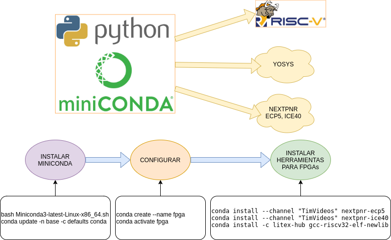

<!--

author: Carlos Camargo, Johnny Cubides

comment: Sesión

script:   https://cdn.jsdelivr.net/chartist.js/latest/chartist.min.js
          https://felixhao28.github.io/JSCPP/dist/JSCPP.es5.min.js


link: https://cdn.jsdelivr.net/chartist.js/latest/chartist.min.css

link: https://cdnjs.cloudflare.com/ajax/libs/animate.css/3.7.0/animate.min.css
-->

# Herramientas opensource FPGAs Lattice

--{{0}}--

**Instalación de herramientas**
 
 {{1}}
********************************************************************************
**Instalación de Herramientas usando CONDA**

                           --{{1}}--



[Link de guía de instalación de herramientas usando CONDA](https://github.com/unal-digital-electronic/litex-and-softcore-projects/blob/dev-tools/synthesis-compilation-and-programming-tools/CONDA-ice40-ecp5-cross-compilers/README.md)
 
********************************************************************************

{{2}}
********************************************************************************

**Instalación de Litex**

                           --{{2}}--
                           
**Litex para placa Colorlight 5A-75E**
=====================

Por ahora como no se tiene el esquemático de ésta placa, se está portando los pines de la placa Colorlight 5A-75B a las fuentes de LiteX a través de un fork que hemos realizado a litex_boards, las fuentes agregadas son:

[litex_boards/platforms/colorlight_5a_75e.py](https://github.com/unal-digital-electronic/litex-boards/blob/master/litex_boards/platforms/colorlight_5a_75e.py)
[litex_boards/targets/colorlight_5a_75e.py](https://github.com/unal-digital-electronic/litex-boards/blob/master/litex_boards/targets/colorlight_5a_75e.py)

Se reitera que éste soporte es de prueba y por tanto está en desarrollo, para instalarlo siga las instrucciones de abajo.


**Instalación de Litex con soporte para Colorlight 5A-75E**
=====================
                           
1. Escoja un un directorio en su PC para instalar LiteX
2. Descargue el instalador de LiteX como se explica en el repositorio de [LiteX], ejemplo: wget https://raw.githubusercontent.com/enjoy-digital/litex/master/litex_setup.py
3. Edite el archivo descargado litex_setup.py cambiando la línea referente al repositorio de litex-boards por el repositorio donde se ha agregado las fuentes para la board colorlight 5A-75E
```python
    # ("litex-boards", ("https://github.com/litex-hub/",     False, True)),
    ("litex-boards", ("https://github.com/unal-digital-electronic/",     False, True)),
```
4. Guarde los cambios en el archivo ltex_setup.py y de permisos de ejecución, ejemplo: chmod +x litex_setup.py
5. Finalmente instale LiteX en su equipo: ./litex_setup.py init install --user

En el siguiente ejemplo de instalación se muestra la modificación planteada en el paso **3.**, también se plantea
la descarga de los archivos fuente **solo** para los softcore **lm32**, **pico32** riscv y **vexriscv**.

[](https://asciinema.org/a/331584)


**Actualizar LiTeX**
=====================
                           
```bash
./litex_setup.py update
```

**Referencias**
=====================
                           
[enjoy-digital/litex](https://github.com/enjoy-digital/litex)

********************************************************************************

