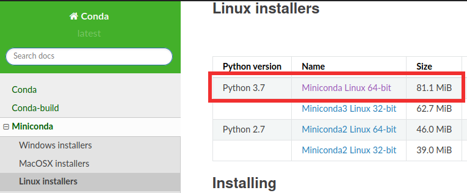

<!--

author: Carlos Camargo, Johnny Cubides

comment: Sesión

script:   https://cdn.jsdelivr.net/chartist.js/latest/chartist.min.js
          https://felixhao28.github.io/JSCPP/dist/JSCPP.es5.min.js


link: https://cdn.jsdelivr.net/chartist.js/latest/chartist.min.css

link: https://cdnjs.cloudflare.com/ajax/libs/animate.css/3.7.0/animate.min.css
-->

# Herramientas opensource FPGAs Lattice

--{{0}}--

 {{1}}
********************************************************************************

**Instalación de Herramientas usando CONDA**

                          --{{1}}--


Conda permite administrar las herramientas de desarrollo de manera sencilla ya que en éste caso nos ofrece los precompilados de Yosys, nextpnr, compiladores y otras herramientas útiles, que en otros casos deberían ser compiladas desde las fuentes, lo que requiere más recursos.

Los comandos a usar son sencillos tanto para instalar, actualizar y ejecutar entornos. A continuación se explica los pasos de instalación de las herramientas.
 
**Herramientas a instalar**

* [Yosis](https://github.com/YosysHQ/yosys)
* [Nextpnr](https://github.com/YosysHQ/nextpnr)
* [gcc riscv32](https://github.com/riscv/riscv-gnu-toolchain)

**Pasos de instalación**

**1. Instalación de MINICONDA**

**Nota**: No existe problema si en su PC tiene una versión de `python3` instalada.

**1.1 Descargar** [miniconda de éste link](https://docs.conda.io/en/latest/miniconda.html#linux-installers)



**1.2 Instalación de MINICONDA**

Ejecute el siguiente comando y siga las instrucciones del instalador
```bash
bash Miniconda3-latest-Linux-x86_64.sh
```

**Nota 1**: el directorio de instalación de miniconda por default será `/home/user/miniconda3`

**Nota 2**: Ésta instalación afecta directamente al bashrc ubicado en `~/.bashrc`,
se recomienda revisar el estado de éste archivo donde miniconda3 agregó las líneas al final

**1.4 Actualizar miniconda**

```bash
conda update -n base -c defaults conda
```

**1.5 Creación de entorno**

Un entorno permite que conda presente las herramientas según nuestros
intereses; por ejemplo si se crea el entorno FPGA y se instala las herramientas
deseadas, cada vez que active ese entorno, conda agregará al PATH los binarios y
librerías que se ha instalado para tal fin; es una manera de organizar nuestros recursos.

**Nota**: en realidad conda crea un entorno `base` así que sino desea crear un entorno
podría saltarse éste paso teniendo encuenta éste hecho.

Ejecute el siguiente comando para crear el entorno **FPGA**:

```bash
conda create --name fpga
```

Para activar el entorno creado ejecute el siguiente comando:

```bash
conda activate fpga
```

**2. Instalación de NEXTPNR, YOSYS y cross-compiladores**

```bash
conda install --channel "TimVideos" nextpnr-ecp5
conda install --channel "TimVideos" nextpnr-ice40
conda install --channel "TimVideos" gcc-riscv32-elf-newlib
conda install --channel "TimVideos" iceprog
```

**Verificación de herramientas instaladas**

```bash
yosys -V
nextpnr-ecp5 -V
riscv32-unknown-elf-gcc -v
```

**Fuentes**

[Documentación de miniconda](https://docs.conda.io/en/latest/miniconda.html)

[Instalación de miniconda](https://conda.io/projects/conda/en/latest/user-guide/install/linux.html)

[Manejo de entornos conda](https://docs.conda.io/projects/conda/en/latest/user-guide/getting-started.html#managing-environments)

[Manejo de entornos en coda](https://uoa-eresearch.github.io/eresearch-cookbook/recipe/2014/11/20/conda/)

[Canal conda de timvideos](https://anaconda.org/timvideos/repo/installers)

[litex-conda-packages](https://github.com/litex-hub/litex-conda-packages)

 
********************************************************************************

{{2}}
********************************************************************************

**Instalación de Litex**

                           --{{2}}--
                           
**Litex para placa Colorlight 5A-75E**

Por ahora como no se tiene el esquemático de ésta placa, se está portando los pines de la placa Colorlight 5A-75B a las fuentes de LiteX a través de un fork que hemos realizado a litex_boards, las fuentes agregadas son:

[litex_boards/platforms/colorlight_5a_75e.py](https://github.com/unal-digital-electronic/litex-boards/blob/master/litex_boards/platforms/colorlight_5a_75e.py)
[litex_boards/targets/colorlight_5a_75e.py](https://github.com/unal-digital-electronic/litex-boards/blob/master/litex_boards/targets/colorlight_5a_75e.py)

Se reitera que éste soporte es de prueba y por tanto está en desarrollo, para instalarlo siga las instrucciones de abajo.


**Instalación de Litex con soporte para Colorlight 5A-75E**
                           
1. Escoja un un directorio en su PC para instalar LiteX
2. Descargue el instalador de LiteX como se explica en el repositorio de [LiteX], ejemplo: wget https://raw.githubusercontent.com/enjoy-digital/litex/master/litex_setup.py
3. Edite el archivo descargado litex_setup.py cambiando la línea referente al repositorio de litex-boards por el repositorio donde se ha agregado las fuentes para la board colorlight 5A-75E
```python
    # ("litex-boards", ("https://github.com/litex-hub/",     False, True)),
    ("litex-boards", ("https://github.com/unal-digital-electronic/",     False, True)),
```
4. Guarde los cambios en el archivo ltex_setup.py y de permisos de ejecución, ejemplo: chmod +x litex_setup.py
5. Finalmente instale LiteX en su equipo: ./litex_setup.py init install --user

En el siguiente ejemplo de instalación se muestra la modificación planteada en el paso **3.**, también se plantea
la descarga de los archivos fuente **solo** para los softcore **lm32**, **pico32** riscv y **vexriscv**.

[](https://asciinema.org/a/331584)


**Actualizar LiTeX**
                           
``` bash
./litex_setup.py update
``` 

**Referencias**

[enjoy-digital/litex](https://github.com/enjoy-digital/litex)

********************************************************************************

 
## **Hola LiteX en CL 5A-75E**

En éste ejemplo se encenderá el led de usuario de la placa Colorlight 5A-75E y un led externo conectado al pin J1.3 por medio de tokens enviados por el puerto serial; **leds-on** y **leds-off**.

!?[Ejemplo](img/gif.mp4)


El gateware (emulación del hardware) consta de un softcore (vexriscv) el cual es construido con LiteX y sintetizado con herramientas libres como yosis y nextpnr, mientras que el firmware + bios de LiteX es cross-compilado con el compilador de riscv.

Tanto la imagen del gateware y de la bios son programados a la fpga, mientras que el firmware es cargado por el puerto serial(para éste ejemplo) haciendo uso de la bios de LiteX; ésto hace que en la creación de proyectos se pueda desarrollar el firmware (programa del softcore) y probarlo de manera independiente sin necesidad de volver a sintetizar el hardware (gateware).

A continuación se presentan los pasos para replicar éste ejemplo (Hola LiteX).

**Hardware**

Para éste ejemplo se usó la tarjeta Colorlight 5A-75E en la cual se extrajo el chip `74HC245` etiquetado como **u28** para lograr la conexión UART entre la placa y el PC; es necesario retirarlo y crear los puentes mostrados allí ya que éste integrado tiene un selector de control sobre la dirección del flujo de los datos.

 

**Conexiones**

|Conector |Pin FPGA|Función|
|:-------------:|:-------------:|:-----:|
| J1.1 | F3 |TX|
| J1.2 | F1 |RX|
| J1.3 | G3 |LED externo|
|LED en la placa| P11 |LED usuario|
|Botón en la placa| M13 |Botón de reset|
| J1.4 || GND |
| J1.15 || GND |
| J1.16 || GND |

**Instalación de herramientas**

* **A tener en cuenta**: para que se comprenda de mejor manera como desarrollar los pasos **1** y **2** se recomienda desarrollar el ejemplo del **Hola mundo con colorlight5a-75e** que puede seguir en [éste link](https://github.com/unal-digital-electronic/litex-and-softcore-projects/wiki/Hola-mundo-ColorLight-5A-75E).

**Pasos de instalación de herramientas**

1. Herramientas de síntesis opensource para FPGA ecp5 y cross-compilador para riscv -> [Instalación de herramientas de desarrollo con CONDA](https://github.com/unal-digital-electronic/litex-and-softcore-projects/wiki/Herramientas-para-FPGAs-Lattice).
2. Herramienta de programación para FPGAs y método de programación -> [OpenOCD en Omega2, programando FPGA por JTAG](https://github.com/unal-digital-electronic/litex-and-softcore-projects/blob/dev-openocd-tool/openocd-tool/host/omega2/colorlight-5A-75E-openocd-config/README.md).
3. LiteX con soporte para la placa colorlight5a-75e -> [Como instalar LiteX con soporte a la board colorlight 5a-75e](https://github.com/unal-digital-electronic/litex-and-softcore-projects/wiki/Instalaci%C3%B3n-de-Litex#litex-para-placa-colorlight-5a-75e).

**Construcción del demo**

El demo es desarrollado con las fuentes que encontrará en [éste link](https://github.com/unal-digital-electronic/litex-and-softcore-projects/tree/dev-cl-5a-75e-examples/cl-5a-75e-project-example/litex-vexriscv-blink) las cuales también encontrará [comprimidas acá en .zip](https://github.com/unal-digital-electronic/litex-and-softcore-projects/raw/dev-cl-5a-75e-examples/cl-5a-75e-project-example/litex-vexriscv-blink/litex-vexriscv-blink.zip) para que no sea necesario clonar el repositorio.
Descargue estos archivos fuentes a su equipo y ubíquese al nivel donde encontrará el *Makefile* responsable de la construcción del demo.

**Pasos para la construcción del demo**

En éste diagrama se puede apreciar la relación de los elementos que se contruirán a partir de los comandos los cuales están numerados del **1** hasta el **5**.


**1. Construir el gateware y el bios**

```bash
make gateware
```

**2. Programar FPGA con la imagen gateware+bios**

Dependiendo del hardware de programación que tenga, haga uso de alguno
de los siguientes métodos:

**2.1 Programando FPGA desde Omega2**

* Enviar la imagen desde el pc a placa omega2 a través de ssh

```bash
make prog-f-o2
```

* Programar fpga a través de omega2 por jtag

```bash
sh program.sh top-flash.svf
```

**3. Construir el firmware del blink**

```bash
make firmware
```

**4. Cargar el firmware.bin al softcore**

Lanzar el servidor litex:

```bash
make litex_term
```

Cargar el firmware.bin desde el bios:

```bash
serialboot
```

**5. Dar ordenes al softcore a través de tokes desde el puerto serial**


Ejecutar los tokens:

```bash
leds-on
leds-off
```

**6. Referencias**

[trabucayre/litexOnColorlightLab004](https://github.com/trabucayre/litexOnColorlightLab004)

[litex-hub/fpga_101](https://github.com/litex-hub/fpga_101)

********************************************************************************
