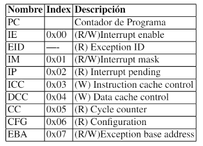

# LM32

|  | 
|:--:| 
| *Figura 1. LatticeMico32* |

LatticeMico32 es un núcleo blando de microprocesador de 32 bits de Lattice Semiconductor optimizado para matrices de puertas programables en campo (FPGA). Utiliza una arquitectura Harvard, lo que significa que los buses de instrucciones y de datos están separados. La lógica de arbitraje del bus se puede utilizar para combinar los dos buses, si se desea.

La estructura de una máquina de estados algorítmica permite una mejor comprensión sobre la estructura de un procesador ya que integran los mismos componentes principales (unidad de control y camino de datos), la diferencia entre ellos es la posibilidad de programación y la configuración fija del camino de datos del procesador.

# Arquitectura del procesador LM32

La arquitectura del procesador MICO32 creado por la empresa Lattice semiconductor y gracias a que fué publicado bajo la licencia GNU, es posible su estudio, uso y modificación. La siguiente figura muestra por medio del diagrama de bloques la arquitectura del procesador LM32:

|  | 
|:--:| 
| *Figura 2. Arquitectura LM32* |


Este procesador en su arquitectura se compone de 6 etapas del *pipeline*, tambien cuenta con una logica de *bypass* que se encarga de hacer que el camino de datos entre operaciones sea más corto y se puedan ejecutar en un ciclo sencillo, de esta manera los datos no recorren todo el pipeline para completar instrucciones.

Las 6 etapas del pipeline son:


|  | 
|:--:| 
| *Figura 3. Etapas pipeline* |


# Banco de registros

El LM32 posee 32 registros de 32 bits, el registro *r0* siempre contiene el valor 0, necesario para el correcto funcionamiento de los compiladores de C y ensamblador; los siguientes registros *r1 a r7* son utilizados para paso de argumentos y retorno de resultados en llamados a funciones; si una función requiere de más de 8 argumentos se hace necesario el uso de la pila *stack*. Los registros *r1 a r28* pueden ser utilizados como fuente o destino de cualquier instrucción. El registro *r29* es utilizado exclusivamente por la instrucción *call* para almacenar la dirección del retorno. El registro *r30 (ea)* es utilizado para almacenar el valor del contador del programa cuando se presenta una excepción. El registro *r31 (ba)* almacena el valor del contador de programa cuando se presenta una excepción tipo *breakpoint* o *watchpoint*. Los registros *r26 (gp)*, *r27 (fp)* y *r28 (sp)* son el punteero global, de frame y de pila respectivamente. Después del reset los 32 bits quedan indefinidos, por lo que es fundamental al inicializar el programa asegurar un 0 en el registro r0.

## Registro de estado y control

En la siguiente tabla, se pueden observar los registros de estado y control (CSR), indicando si son de lectura o escritura y el índice que se utiliza para tener aceeso al registro.



1. Contador de programa (PC)

El contador de programa es un registro de 32 bits que contiene la direccion de la instruccion que se ejecuta actualmente. Debido a que todas las instrucciones son de 32 bits, los dos bits menos significativos de PC siempre son zero. El valor de este registro despuos del reset es h00000000.

2. IE Habilitacion de interrupción

l registro IE contiene la bandera IE, que determina si se habilitan o no las interrupciones. Si este flag se desactiva, no se presentan interrupciones a pesar de la activacion individual realizada con IM. Existen dos bits BIE y EIE que se utilizan para almacenar el estado de IE cuando se presenta una excepcion tipo breakpoint u otro tipo de excepcion.

### EID Exception ID

El índice de la excepción es un número de 3 bits que indica la causa de la detención de la ejecución del programa. Las excepciones son eventos que ocurren al interior o al exterior del procesador y cambian el flujo normal de ejecución del programa. Los valores y eventos correspondientes son: 

0. Reset; se presenta cuando se activa la señal de reset del procesador.
1. Breakpoint; se presenta cuando se ejecuta la instrucción break o cuando se alcanza un punto de break hardware.
2. Instruction Bus Error; se presenta cuando falla la captura en una instrucción, regularmente cuando la dirección no es válida.
3. Watchpoint; se presenta cuando se activa un watchpoint.
4. Data Bus Error; se presenta cuando falla el acceso a datos, típica mente porque la dirección solicitada es inválida o porque el tipo de acceso no es permitido.
5. División por cero; Se presenta cuando se hace una división por cero.
6. Interrupción; se presenta cuando un periférico solicita atención por parte del procesador. Para que esta excepción se presente se deben habilitar las interrupciones globales (IE) y la interrupción del periférico (IM).
7. System Call; se presenta cuando se ejecuta la instrucción scall.

### IM Máscara de interrupción

La máscara de interrupción contiene un bit de habilitación para cada una de las 32 interrupciones, el bit 0 corresponde a la interrupción 0. Para que la interrupción se presente es necesario que el bit correspondiente a la interrupción y el flag IE sean igual a 1. Después del reset el valor de IM es h00000000.

### IP Interrupción pendiente

El registro IP contine un bit para cada una de las 32 interrupciones, este bit se activa cuando se presenta la interrupción asociada. Los bits del registro IP deben ser borrados escribiendo un 1 lógico.

## Set de instrucciones del procesador Mico32

Una instrucción no es más que una acción que mandamos a hacer en un procesador. Las instrucciones pueden ser operaciones aritméticas con diferentes tipos de datos como enteros, coma flotante, vectorial, escalar, operaciones lógicas, operaciones de movimientos de datos, operaciones de movimiento de bits (donde un bit es cambiado de posición), operaciones de salto, etc.

Para facilitar el estudio se realizó una división en cuatro grupos comenzando con las instrucciones aritméticas y lógicas, siguiendo con las relacionadas con saltos, después se analizará la comunicación con la memoria de datos y finalmente las relacionadas con interrupciones y excepciones. Para cada uno de estos grupos se mostrará el camino de datos (simplificado) asociado al conjunto de instrucciones.

### Instrucciones aritméticas

#### Entre registros

El camino de datos simplificado de las operaciones aritméticas y lógicas cuyos operandos son registros, y cuyo resultado se almacena en un registro. En otras palabras son de la forma: gpr[RX] = gpr[RY] OP gpr[RZ], donde: OP puede ser nor, xor, and, xnor, add, divu, modu, mul, or, sl, sr, sru, sub. Como puede verse en esta figura la instrucción contiene la información necesaria para direccionar los registros que almacenan los operandos RY (instruction d25:21) y RZ (instruction d 20:16), estas señales de 5 bits direccionan el banco de registros y el valor almacenado en ellos puede obtenerse en dos salidas diferentes ( gpr[rz] y gpr[ry]). En el archivo rtl/lm32/lm32 cpu.v se implementa el banco de registros de la siguiente forma:

**assign** reg data 0 = r e g i s t e r s [ read idx 0 d ];
**assign** reg data 1 = r e g i s t e r s [ read idx 1 d ];

En este código reg_data_0 y reg_data_1 son las dos salidas **gpr[rz]** y **gpr[ry]**; las señales *read_idx_0_d* y *read_idx_1_d* corresponden a *instruction_d 25:21* y *instruction_d 20:16* respectivamente. El contenido de los registros direccionados de esta forma son llevados al modulo *logic_op* donde se realiza la operacion correspondiente a la instrucción y el resultado pasa a través de los estados del pipeline hasta llegar a la señal *w_result* (parte inferior de la figura). Esta señnal entra al banco de
registros para ser almacenada en la dirección dada por la señal *write_idx_w* la cual es fijada por la instrucción, más espec´ ıficamente por (instruction_d 15:11). En el archivo *rtl/lm32/lm32_cpu.v* se implementa esta escritura al banco de registros de la siguiente forma:

```
always @( posedge clk_i )

begin

    if( reg_write_enable_q_w == 'TRUE')
    
    registers[write_idx_w] <= w_result ;

end

```


#### Inmediatas

Existe otro grupo de operaciones lógicas y aritméticas en las que uno de los operandos es un registro y el otro es un número fijo, esto permite realizar operaciones con constantes que nos son almacenadas previamente en registros, sino que son almacenadas en la memoria de programa. En la figura se muestra como se modifica el camino de datos para este tipo de instrucciones; en ella, podemos observar que *instruction_d 25:21* direcciona uno de los operandos que está almacenado en el ban- co de registros y de forma similar al caso anterior el dato almacenado es llevado al bloque *logic_op*. El segundo operando es llevado a este bloque desde un multiplexor donde se hace una extensión de signo de *instruction_d 15:0* o se hace un corrimiento a la derecha de 16 posiciones; esto, para convertir el número de 16 bits a uno de 32 bits, lo que da como resultado *16instruction_d[15]*, *instruction_d[15:0]* y *instruction_d[15:0]*, *16’h0000* respectivamente; el corrimiento de 16 bits a la derecha se hace para poder realizar las operaciones andhi y orhi, las cuales solo operan sobre la parte alta de los operandos.


### Saltos

Los saltos permiten controlar el flujo de ejecución del programa posibilitando la implementación de ciclos, llamado a funciones, y toma de decisiones. En esta sub-sección estudiaremos el camino de datos resultante para este tipo de instrucciones. A diferencia de las instrucciones aritméticas y lógicas, en este tipo de instrucciones se modifica el valor del contador de programa.

#### Condicionales

En los saltos condicionales la instrucción se almacena la dirección de los registros que deben ser comparados, específicamente en *instruction_d 25:21* e *instruction_d 20:16*; los valores almacenados en estos registros son llevados al sumador y a un bloque especial que determina si se cumple o nó la condición (señales rojas en la gráfica); la señal *condition_met_x* se activa si la condición se cumple. En la figura se muestra el camino de datos para las instrucciones condicionales.

Para que el valor del contador de programa se modifique, es necesario que las señales *condition_met_x*, *branch_m* y *valid_m* se encuentren activas (señales anaranjadas en la gráfica); la señal *branch_m* se activa cuando la instrucción es de tipo *branch* o *call*; la señal *valid_m* se activa cuando se presenta una instrucción válida. Adicionalmente, es necesario que el procesador no se encuentre en un estado de *stall*. Si se cumplen las condiciones anteriores, se activará la señal *branch_taken_m*, la que le indicará a la unidad de instrucciones que cargue el valor de la señal *branch_target_m* en el contador de programa. 

El valor de branch_target_m (señal azul en la gráfica) es fijado por dos diferentes métodos: cuando se produce una excepción o cuando se produce un salto, la señal exception x selecciona el valor adecuado para cada caso. La señal branch_target_x es el resultado de la suma de pc_d y de branch_offset_d (para esta suma no se utiliza el bloque sumador). El valor de branch_offset es seleccionado por la señal select call immediate entre las señales call immediate (para instrucciones de llamado a función) y branch immediate; está última tiene como valor *16inst[15]*, *inst[15:0]*, lo que es una extensión de signo de la constante de 16 bits almacenado en la memoria de programa.


*Instrucciones saltos condicionales*

En la figura se ilustran 3 ciclos que utilizan condicionales; en color azul se muestra el código en C y en negro se muestra el código implementado por el compilador. 


#### Llamado a función y salto incondicional

Existen dos tipos de llamado a función y de salto incondicional; su diferencia radica en la forma de almacenar la dirección a la que deben saltar. En la figura ?? se muestra el camino de datos correspondiente a las instrucciones calli y bi, estas almacenan en la instrucción la dirección y en la figura ?? se muestra el camino de dato correspondiente a las instrucciones call y b las que almacenan la dirección en un registro.

Para ambos casos el contador de programa es modificado si se activan las señales condition met x, branch m y valid m; la se˜ nal valid m se activa cuando se presenta una instrucción válida; branch m (color amarillo en los graficos) se activa cuando la instrucción que se está ejecutando es un salto o un llamado a función; y condition met x se activa cuando se cumple con la condición para el salto, debido a que estos saltos y llamados son incondiconales, el MICO32 contempla dos casos en los que activa esta se˜ nal, tal como se muestra a continuación (tomado de rtl/lm32/lm32 cpu.v):

```
always @∗
begin
  case ( instruction [28:26])
  3’b000 : condition met x = ‘TRUE;
  3’b110 condition met x = ‘TRUE;
  . . . .
  . . . .
  . . . .
  default : condition met x = 1’bx ;
  endcase
end
```

Los bits instruction[28:26] hacen parte del código de la instrucción; el valor para las instrucciones bi y b es 000 y para call y callies 110,lo que activa condition met x cada vez que se presentan estas instrucciones.De forma similar a las instrucciones relacionadas con saltos condicionales el valor del contador de programa es igual al valor de las señal branch target x (señal de color verde en las figuras); el valor de esta señal para las instrucciones call y b proviene del valor almacenado en el registro seleccionado por instruction d [25:21]. Para las instrucciones calli y bi el valor está dado por la señal branch offset la que toma como valor 6ins[25],ins[25:0] o 16ins[15],ins[15:0] para una instrucción call o b respectivamente.

Adicionalmente, para las instrucciones de llamado a función call y calli se debe almacenar en el registro R29 la dirección de memoria siguiente a la que se realizó el llamado a la función, esto con el fín de retornar al flujo de programa principal, esto se logra haciendo uso del pipeline y se utiliza el valor del contador de programa pc m cuyo valor contiene el valor adecuado para el retorno del llamado a función; el valor de pc m (señal color morado en las figuras) es asignado a la señal w result del banco de registros para ser almacenado en el registro indicado por write idx (señal marrón en los gráficos); la que toma el valor de 29 cuando se presenta una
instrucción *calli* o *call*.


 
En la figura se muestra un ejemplo de uso de la función call. El código en C utilizado para este ejemplo se muestra en color azul. La línea de código result1 = function(0x30) hace el llamado a la función function pasándole el parámetro 0x30 (decimal 48); el código implementado por el compilador se muestra junto al código en C; como se mencionó  anteriormente, los primeros registros del banco de registros se usan para pasar parámetros entre funciones, en el paso 1, se almacena el valor 0x30 (48 decimal) en r1; en el paso dos se hace un llamado inmediato a función a la dirección de memoria 0x8C, lo que hace que el valor del contador de programa tome el valor 0x8C y se almacene el valor 0x310 en el registro ra.

La función function está declarada como int function(int x) y reside en la posición de memoria 0x8C. En el paso 3, se almacena el valor de los registros que se utilizan en la función con el fín de restaurarlos antes de retornar al programa donde fué llamada, esto se hace debido a que solo existe un banco de registros en el procesador y si no se hace esto el valor de los registros antes y después del llamado será diferente lo que ocasionará errores en los algoritmos implementados. EL registro ra almacena el valor de la dirección de retorno, y se almacena para asegurar que cuando se hagan llamados a función anidados se retorne a la dirección adecuada. En el paso 4 se restaura el valor de los registros, garantizando la continuidad del programa principal; finalmente, en el paso 6 la función ret carga el valor del ra en el contador de programa.


En la figura se ilustra la importancia del almacenamiento de los registros en los llamados a funciones, para este ejemplo se consideró el registro ra; cuando se almacena el registro ra en la función F2 para ser restaurado al finalizar la función el flujo de programa retorna a la función F1, lo que se ejecuta correctamente en los dos casos. Cuando finaliza F1 el valor de ra varía; cuando no se almacena el valor la dirección de retorno de F1 es modificada por lo que cuando se retorna el contador de programa se hace igual a la dirección de retorno de F2.


### Comunicación con la memoria de datos

Antes de estudiar el camino de datos correspondiente a este grupo de instrucciones, hablaremos de los tipos de datos que soporta el procesador MICO32. En la figura se muestran ejemplos de manipulación de diferentes tipos de datos y como estos son tratados en la memoria del procesador.

#### Tipos de datos

El primer tipo de datos que se muestra en esta figura es el char, la variable data8 es declarada como un volatile unsigned char *, es decir un puntero a un char sin signo tipo volatile; los tipos de datos volatile le indican al compilador que no realice optimizaciones sobre esta variable, lo que es importante cuando se direccionan periféricos. Al puntero data8 se le asigna la dirección 0x400 y el valor 0x44. Si se aumenta el valor de la dirección del puntero en una posición data8++ la nueva dirección será 0x401 y si se aumenta de nuevi pasará a ser 0x402; lo que indica que el procesador a pesar de ser de 32 bits puede realizar direccionamiento con granularidad byte; esto es muy conveniente para un almacenamiento eficiente de información, de no ser as´ ı se utilizar´ ıa una palabra de 32 bits para almacenar 8 bits.

La segunda parte de la figura se ilustra el manejo del tipo de dato short el cual es de 16 bits; para esto se utiliza en puntero data16 con una dirección inicial de 0x200 y un valor de 0x2020; al aumentar la dirección del puntero en 1 (data16++) la dirección resultante es 0x202, lo que permite el almacenamiento eficiente de este
tipo de dato.

Finalmente se ilustra el tipo de datos int y se observa como las direcciones de memoria inical y final después de aumentar el valor del puntero son 0x300 0x304; lo que muestra que el direccionamiento interno de la memoria depende del tipo de datos.


El procesador MICO32 posee 4 señales D SEL O[3:0] que son utilizadas para indicarle a los periféricos el tipo de operación de lectura/escritura que se está efectuando; en la figura se observa que estas señales se activan de forma individual indicando el byte que se está direccionando; en la figura las señales se activan por parejas indicando el grupo de 2 bytes que se está direccionando; finalmente en la figura las 4 se˜ nales se activan al tiempo lo que indica un acceso a los 4 bytes al mismo tiempo.


#### Escritura a la memoria de datos

El acceso a memoria de datos permite extender las capacidades del procesador posibilitando la conexión de periféricos; los que a su vez, realizan la comunicación con el exterior utilizando diferentes protocolos de comunicación y medios físicos. En esta subsección se describirá la forma en la que el MICO32 implementa las operaciones de lectura y escritura a la memoria de datos.

En la figura se ilustra el camino de datos asociado a las instrucciones sb, sh y sw. En las tres, el valor contenido en el registro direccionado por instruction d[25:21] (RX señales color rojo en la figura) más el valor de 16 bits (con signo extendido a 32 bits) forman la dirección a la que se desea escribir. El valor contenido en el registro direccionado por instruction d[20:16] (RY se˜ nales color azul en la figura) corresponde al dato que será escrito en esa posición de memoria; de esta forma se construyen los buses de datos y direcciones del procesador. Cómo se dijo anteriormente el MICO32 direcciona con granularidad de byte, por esta razón en las instrucciones sh y sw se indica el valor escrito en las direcciones +1 y +1, +2 y +3 respectivamente; indicando el tama˜ no en bytes del tipo de dato escrito. Estas señales ingresan a un módulo llamado load store unit que se encarga de generar las señales correspondientes al bus wishbone, más adelante estudiaremos en detalle el funcionamiento de este bus.

En la figura ??, y ?? se muestran las formas de onda cuando se escribe un dato tipo char (0x44) a la dirección 0x400, el dato escrito en el bus es 0x44444444 para que el periférico pueda utilizar cualquiera de las cuatro partes del bus de datos D DAT O[7:0], D DAT O[15:8], D DAT O[23:16], D DAT O[31:24], algo similar ocurre en la escritura del tipo de dato short (con valor 0x2020) mostrado en la figura ??, aquí se repite el dato para poder utilizar dos partes del bus del datos D DAT O[15:0] y D DAT O[31:16].

#### Lectura

En la figura ?? se muestra el camino de datos asociado a las instrucciones lb/lbu, lh/lhu y lw. La dirección de la cual se leera se calcula de forma similar al caso de la escritura; el valor contenido en el registro direccionado por instruction d[25:21] (RY se˜ nales color rojo en la figura). El dato le´ ıdo por el módulo load store unit (señal morada en la figura) es almacenado en el registro cuya dirección está dada por instruction d[20:16].

### Interrupciones

Existen dos formas de conocer si un periférico conectado al procesador requiere atención por parte del procesador; examinando de forma constante los registros de estado del periférico o utilizando interrupciones. La consulta constante de los registros de estado del periférico requiere incluir en el código una rutina que realice esta operación, la cual debe ser llamada de forma regular en el programa principal, la velocidad con que se realice esta consulta debe ser la adecuada para que no se pierdan eventos; debido a esto; uno de los problemas de esta técnica es que al aumentar el número de periféricos aumenta el tiempo entre consultas para un periférico, lo que aumenta la posibilidad de pérdida de eventos; adicionalmente, aumenta el tiempo dedicado a la consulta, lo que disminuye el tiempo disponible para ejecutar las tareas software en el procesador.

Las interrupciones modifican el flujo normal de ejecución del sistema y son originadas por señales dedicadas, lo que hace que su atención ocurra de forma inmediata. Cuando se presenta una interrupción, el valor del contador de programa toma un valor fijo que recibe el nombre de vector de interrupción, el valor del vector de interrupción está formado por (ver figura ?? señales de color rojo) una dirección base EBA (Exception Base Address) que por defecto es 0x00, un índice que indica la exepción que se presentó eid x (6 para la interrupción) y tres ceros; estos tres ceros hacen que el espacio entre vectores de excepción sea de 8 palabras de 32 bits, por lo que la rutina de atención a la interrupción debe tener máximo 8 instrucciones (esta rutina se explicará más adelante); para la interrupción el valor del vector es de 0x30. 

Como se puede observar en la figura ?? para que se genere una excepción (señales de color azul), se debe activar cualquiera de las señales instruction bus error exception, system call exception exception,data bus error exception,divide by zero exception o interrupt exception; lo que activará la se˜ nal branch taken m quien a su vez realiza el cambio en el contador de programa pc a. Para que la se˜ nal interrupt exception se active es necesario: 1- habilitar la generación de interrupciones, es decir, que el flag ie (interrupt enable) está activo; 2- habilitar la generación de la interrupción deseada, para esto el bit correspondiente a la interrupción debe ser igual a 1 en la señal im (interrupt mask), lo que recibe el nombre de enmascaramiento y 3 - Que el periférico asociado a la interrupción realice una solicitud de atención activando su señal de interrupción, lo que origina una activación de la se˜ nal correspondiente en ip (interrupt pending).
 
Al activarse la señal exception x la variable que direcciona el registro a ser escrito en el banco de registros write idx toma el valor 30 decimal (ea - exception address) y el valor a ser escrito (w result) será pc m, 2’b00 (los saltos en el contador de programa es de a 4 bytes, debido a que las instrucciones son de 32 bits, por esta razón los dos bits menos significativos no son tomados en cuenta); lo que garantiza que al salir de la interrupción, el programa principal continuará donde se interrumpió.


#### Rutina de atención a la interrupción

A continuación se lista la rutina que se ejecuta cada vez que se presenta una interrupción; como se dijo anteriormente, la dirección del vector de interrupción debe ser 0x48, por lo que este código debe residir en la memoria de programa en dicha dirección.

8     sw       (sp +0) , ra
49    calli    _save_all
50    rcsr     r1 , IP
51    calli    irq_handler
52    mvhi     r1 , 0 xffff
53    ori      r1 , r1 , 0 xffff
54    wcsr     IP , r1
55    bi       _restore_all_anderet

En la línea 48 se almacena el valor del registro ra en la pila (la pila es una región de la memoria RAM que se utiliza para diferentes propósitos en la ejecución de un programa), esto se hace para que al salir de la rutina de atención a la interrupción el programa continúe de forma adecuada, de no hacer esto, si la interrupción se produjo cuando se estaba ejecutando una función el valor de retorno de la interrupción se modificaría. 

En la línea 49 se hace un llamado a la función save all:

      addi sp , sp , −128
      sw ( sp +4) , r1
      . . .
      sw ( sp +108) , r27
#endif
      sw ( sp +120) , ea
      sw ( sp +124) , ba
      /∗ ra and sp need special handling , as they have been modified ∗/
      lw r1 , ( sp +128)
      sw ( sp +116) , r1
      mv r1 , sp
      addi r1 , r1 , 128
      sw ( sp +112) , r1
      ret

En esta función, toma una “fotografía” del estado del procesador en el instante en que se presenta la interrupción, almacenando el valor de todos los registros en la pila, esto se hace para garantizar que el estado del procesador antes y después de la interrupción sea el mismo. En la línea 49 se almacena el valor de la señal ip (interrupt pending) en el registro r1, esto se hace para pasar parámetros a la función que será llamada en la línea 50. irq handler es la función que realizará las acciones correspondientes a una determinada interrupción, esta función debe ser declarada en C en cualquier archivo que haga parte del código fuente de la aplicación (en los ejemplos del repositorio se
declara en el archivo soc-hw.c) como: void irq handler(uint32 t pending).

En las líneas 51 - 53 se llena con unos la señal IP, lo que equivale a una restauración de esta señal, y puede verse como una forma de informarle al procesador que las interrupciones ya fueron atendidas. Finalmente en la línea 54 se hace un llamado a la función restore all and eret:

```
lw r1 , ( sp +4)
. . .
lw r27 , ( sp +108)
lw ra , ( sp +116)
lw ea , ( sp +120)
lw ba , ( sp +124)
/∗ Stack pointer must be restored last , in case i t has been updated ∗/
lw sp , ( sp +112)
eret
```

Esta función: restaura el valor de todos los registros del procesador, incluyendo los registros ra, ea y ba, el registro ea se almacena para asegurar el correcto funcionamiento ante el caso de excepciones anidades; y ejecuta la instrucción eret la que hace que el contador de programa tome el valor almacenado en el registro ea con lo que el programa retorna a la siguiente instrucción del punto donde se generó la interrupción.

Como se mencionó anteriormente, para que la interrupción se presente es necesario habilitar las interrupciones globales y la máscara asociada al periférico. Para esto, el archivo crt0ram.S suministra las siguientes funciones:

```
irq enable :
      mvi r1 , 1
      wcsr IE , r1
      ret
irq disable :
      mvi r1 , 0
      wcsr IE , r1
      ret
irq set mask :
      wcsr IM, r1
      ret
```

En este código se utiliza la instrucción wcsr y en la función de atención a la interrupción ya se había utilizado la instrucción rcsr (rcsrr1,IP); estas instrucciones realizan operaciones de escritura y lectura sobre los registros de estatus y control del procesador. En la figura ?? se muestra el camino de datos relacionado con estas intrucciones.

El camino de color rojo muestra la escritura utilizando la instrucción wcsr; instruction d[20:16] contiene la dirección del registro a ser escrito en csr; y instruction d[25:21] el registro de estatus y control a escribir.

La lectura de los registros de estado y control se muestra en color morado en la figura; de forma similar a la escritura instruction d[25:21] direcciona el registro a leer y instruction d[15:11] la dirección del registro que almacenará el valor leído.


### Retorno de función y de excepción

La figura ?? muestra el camino de datos asociado a las instrucciones de retorno de excepción y de función eret y ret; en estas instrucciones, el valor de la dirección del registro que va a ser almacenado en el contador de programa es fijo (instruction d[25:21]), siendo 30 para la instrucción eret y 29 para la instrucción ret. El valor contenido en estos registros pasa a la se˜ nal branch target y su valor será almacenado en el contador de programa retornando a la dirección siguiente a la que se produjo la excepción o el llamado a función.


En la Figura ?? se resume el proceso de atención a la interrupción. La solicitud de atención por parte de un periférico recibe el nombre de IRQ (interrupt request) y la rutina que atiende esta solicitud recibe el nombre de ISR (interrupt service routine).


## Arquitectura del SoC LM32

En la sección anterior se explicó el funcionamiento detallado de cada grupo de instrucciones del procesador MICO32; en esta sección se realizará una descripción de un SoC (sistema sobre silicio) basado en el procesador MICO32; esta arquitectura permitirá entender los SoC modernos desde el punto de vista estructural y de programación

En la figura ?? se muestra el diagrama de bloques del SoC LM32, el cual tiene como unidad de procesamiento central el procesador MICO32; esta CPU se conecta a una serie de periféricos a través de el bus wishbone. La funcionalidad del SoC está determinada por los periféricos implementados, en esta sección se realizará una descripción de cuatro periféricos básicos para el desarrollo de operaciones básicas de entrada/salida:


* Boot-RAM: Esta memoria almacena la aplicación que se ejecutará al inicializar el SoC.
* UART (Universal Asynchronous Receiver-Transmitter): Puerto serie que permite comunicarse con el exterior y es utilizado como medio de depuración.
* TIMER: Encargado de generar bases de tiempo precisas, de vital importancia en el funcionamiento de la mayor´ ıa de las aplicaciones.
* GPIO: Pines de entrada/salida de propósito general.

Adicionalmente, existe un módulo llamado conbus que realiza la interconexión entre los periféricos y el procesador, su arquitectura y funcionamiento se explicarán más adelante.

### Bus wishbone

El bus wishbone es un bus diseñado para comunicar los diferentes comonentes de un SoC, este bus es abierto y puede ser utilizado libremente. A continueación se listan las señales que componen este bus:

* ack_o: La activación de esta señal indica la terminación normal de un ciclo del bus.
* addr_i: Bus de direcciones.
* cyc_i: Esta señal se activa cuando un ciclo de bus válido se encuentra en progreso.
* sel_i: Estas señales indican cuando se coloca un dato válido en el bus dat i durante un ciclo de escritura, y cuando deber´ ıan estar presentes en el bus dat o durante un ciclo de lectura. El número de señales depende de la granularidad del puerto. El LM32 maneja una granularidad de 8 bits sobre un bus de 32 bits, por lo tanto existen 4 señales para seleccionar el byte deseado (sel i(3:0)).
* stb_i: Esta señal se activa cuando se selecciona un esclavo; el cual debe responder a las otras señales únicamente cuando se activa esta se˜ nal. El esclavo debe activar la señal *ack_o* como respuesta a la activación de *stb_i*.
* we_i: Esta se˜ nal indica la dirección del flujo de datos; en un ciclo de lectura tiene
un nivel lógico bajo y en escritura tiene un nivel lógico alto.
* dat_i: Bus de datos de entrada.
* dat_o: Bus de datos de salida.

En la figura ?? se muestra un ciclo de lectura típico a un periférico con dirección de memoria 0xF0000000, en ella podemos observar la activación de las señales *wb_cyc_i* y *wb_stb_i* indicando un ciclo de bus válido y la selección del esclavo, el valor de *wb_we_i* indica que el acceso es de lectura, a lo que el esclavo debe responder colocando el dato requerido por el procesador en el bus de salida *wb_dat_o* y con la activación de la señal *wb_ack_o*


En la figura ?? se muestra la escritura del valor 0x2A a la dirección de memoria 0xF0000004, las formas de onda son similares a las del ciclo de lectura, salvo que el valor de la señal *wb_we_i* es uno indicando la escritura.


#### Interface del bus wishbone (conmax)

El bus wishbone tiene una arquitectura maestro/esclavo en la que solo los maestros pueden iniciar las operaciones de lectura y escritura y únicamente el esclavo al que se le hace el requerimiento debe responder. Para coordinar la comunicación entre múltiples maestros se debe incluir un árbitro, que en el LM32 recibe el nombre de conmax. La figura ?? muestra el diagrama de bloques de este árbitro. Una de las funciones del árbitro conmax es fijarle un rango de direcciones único a cada periférico, por esta razón todo árbitro debe tener un decodificador de direcciones (módulo ADDRESS DECODER en la figura ??) que tiene como entradas los bits más significativos del bus de direcciones, en este caso solo se usan dos bits (mx adr i[29:28]) ya que solo se cuenta con cuatro periféricos; este decodificador activa las se˜ nales slave sel[3:0] de acuerdo a la definición en el archivo system.v:

```
conbus #(
   . s addr w (2) ,
   . s0 addr (2 ’ b00 ) , / / bram 0x00000000
   . s1 addr (2 ’ b01 ) , / / uart 0x20000000
   . s2 addr (2 ’ b11 ) , / / timer 0x60000000
   . s3 addr (2 ’ b10 ) / / gpio 0x40000000
) conbus0 (
```


Asignado las direcciones de memoria 0x00000000 - 0x1FFFFFFF, 0x20000000 - 0x3FFFFFFF, 0x60000000 - 0x7FFFFFFF y 0x40000000 - 0x5FFFFFFF a la BRAM, UART, TIMER y GPIO respectivamente, la activación de slave sel[3:0] hace que se active su correspondiente se˜ nal s0 stb [3:0] ( y se presenta un ciclo válido de bus) indicándole al periférico que ha sido seleccionado para una operación de lectura o escritura.

En la figura ?? se muestra el circuito simplificado del árbitro conmax para una operación de escritura; en ella se puede observar que todos los esclavos comparten las señales s0 adr o, s0 cti o, s0 sel i, s0 dat o, s0 we o, s0 cyc o y sx dat i, las cuales son la salida de un multiplexor que selecciona entre las se˜ nales correspondientes a los diferentes maestros del SoC (m0 y m1 en este caso); las se˜ nales gnt[0] y gnt[1] seleccionan al maestro que se conectará con todos los esclavos, por esta razón nunca se activarán las dos al tiempo. Las únicas se˜ nales que no comparten los esclavos wishbone son las que indican a los periféricos que han sido seleccionados para una transferencia de información s0 stb [3:0]. slave sel [3:0].


En la figura ?? se muestra el circuito simplificado del árbitro conmax para una operación de lectura; en ella podemos observar que los buses de datos de los periféricos s[3:0] dat i se conectan a los buses de datos de los maestros m[1:0] dat o; las señales slave sel [3:0] se activan una a la vez y seleccionan el esclavo que se conectará con el maestro.


Para ilustrar de forma gráfica la operación del árbitro se implementó un programa que escribe los siguientes valores a las direcciones de los periféricos UART, TIMER y GPIO:

1. 0xAA a la dirección del esclavo 1 0x20000004
2. 0x55 a la dirección del esclavo 3 0x40000000
3. 0xFF a la dirección del esclavo 2 0x60000000

Como podemos ver en la figura ??, las señales gnt[0] y gnt[1] se activan de forma alterna y solo esta activa una de ellas, cuando se escribe el valor 0xAA a la dirección 0x20000004 se activan las señales slave sel [1] y s1 stb o indicando la activación del primer periférico; similarmente, cuando se escribe el valor 0x55 a la dirección 0x40000000 se activan las señales slave sel [3] y s3 stb o indicando la activación del tercer periférico y finalmente, cuando se escribe el valor 0xFF a la dirección 0x60000000 se activan las señales slave sel [2] y s2 stb o indicando la activación del segundo periférico.


### Arquitectura de los periféricos

En esta subsección se realizará un estudio de la arquitectura de los esclavos wishbone, se analizarán tres periféricos: GPIO, UART y TIMER.

#### Periférico GPIO

En todo SoC es necesario contar con pines de entrada/salida de propósito general, este sencillo periférico permite controlar la dirección de un pin, controlar el valor de un pin de salida y leer el valor de un pin de entrada; en la figura ?? se muestra el diagrama de bloques de este periférico.


La dirección del pin es fijada con un buffer tri-estado que a su vez es controlado por el valor almacenado en el registro gpio dir los registros gpio o y gpio input almacenan los valores escritos y leidos de los pines respectivamente. Para entender el comportamiento de este periférico analizaremos los circuitos de lectura y escritura de forma separada. En la figura ?? se muestra el circuito de lectura; el valor del registro gpio input es almacenado en un registro que está conectado al bus de datos de salida del periférico wb dat o cuando la señal wb rd sea igual a 1 y la señal ack sea igual a cero. wb rd es igual a 1 cuando se presente un ciclo de bus válido, se seleccione el periférico y se realice una operación de lectura.


El circuito simplificado de escritura se muestra en la figura ??; en este periférico el bus de datos proveniente del maestro puede almacenarse en los registros gpio dir y gpio o; el multiplexor controlado por wb adr i[3:2] selecciona donde será almacenado el dato. La transferencia al registro seleccionado se realiza únicamente cuando la se˜ nal wb wr sea igual a 1 y la se˜ nal ack sea igual a cero. wb wr es igual a 1 cuando se presente un ciclo de bus válido, se seleccione el periférico y se realice una operación de escritura.


Tanto en la operación de lectura como en la de escritura se debe generar la señal wb ack o para indicarle al maestro que la solicitud de comunicación ha sido recibida y atendida; para esto se implementó el circuito compuesto de las 2 compuertas AND, una compuerta OR y un FLIP FLOP, este circuito hace que la señal ack sea igual a 1 cuando cualquiera de las señales wb rd o wb wr sea igual a 1 y el estado de la señal ack sea igual a 0; es decir, cuando el dispositivo pasa del estado no seleccionado a ser seleccionado para una operación de lectura o escritura.

#### Periférico UART

En la figura ?? se muestra el diagrama de bloques de un periférico un poco más complejo una UART, su arquitectura se basa en un módulo que implementa las tareas de comunicación que se encuentra descrito en el archivo uart.v; en el archivo wb uart.v se hace la adaptación de esta unidad funcional al bus wishbone, esta arquitectura permite que el módulo funcional pueda ser conectado a diferentes buses sin tener que re-escribir todo el código.


Del diagrama de bloques de la UART podemos observar que su arquitectura es similar a la del GPIO, existen los mismos bloques de interconexión con los buses de datos de entrada y de salida y se utiliza el mismo circuito para generar la señal ack.

El circuito simplificado de salida se muestra en la figura ??, se observa que existen dos valores que pueden ser leídos desde el procesador: la señal rx data y los bits de estado tx , tx error y tx avail; en este caso la linea de dirección wb adr i[2] selecciona la información que será transmitida al procesador wb adr i[3:2]


El circuito de escritura se muestra en la figura ??, en este ejemplo el bus de datos proveniente del maestro se conecta directamente a la señal tx data ya que este periférico no permite modificar otros parámetros. Por esta razón el circuito solo transmite un 1 a la señal uart txd lo que hace que la uart transmita el valor fijado por la señal tx data.


#### Periférico TIMER

En la figura ?? se muestra el diagrama de bloques resumido del periférico TIMER; el cual posee 6 registros que pueden ser modificados y leídos por el procesador. De nuevo la arquitectura de este periférico es similar a los anteriores así como el circuito de generación de la señal ack


En la figura ?? se muestra el circuito de lectura del periférico timer. La diferecia frente a los anteriores es la posibilidad de leer 6 diferentes variables; por esta razón se utilizan tres señales del bus de direcciones wb adr i [5:3].


En la figura ?? se muestra el diagrama de escritura del timer, de forma similar al circuito de lectura la señal wb adr i [5:3] selecciona el registro que almacenará el valor proveniente del procesador.


### Interfaz Software

En la subsección anterior se hizo una descripción de los diferentes componentes de la configiración básica del SoC LM32; aquí, se explicará como controlar desde un programa en C la comunicación con los periféricos.

#### Estructura de datos del periférico

Para facilitar el acceso a los diferentes registros de un periférico es conveniente declarar un nuevo tipo de dato que haga una representación de su mapa de memoria. 

En la figura ?? se muestra el diagrama de bloques del GPIO y la declaración del tipo de dato gpio t; el multiplexor que selecciona el sitio donde se almacenará el dato proveniente del procesador está controlado por las l´ ıneas de dirección wb adr i[3:2] cuando estas se˜ nales tengan el valor de 01 o lo que es lo mismo la dirección termine en 0x04 se seleccionará el registro gpio o; si estas se˜ nales tengan el valor de 10 o lo que es lo mismo la dirección termine en 0x08 se seleccionará el registro gpio dir. De aqu´ ı la posición de los elementos write y w dir de la estructura gpio t; al ser declarada la variable read como uint32 t se reservan cuatro bytes (0x00, 0x01, 0x02 y 0x03) para almacenar esta variable, la siguiente posición de memoria (0x04) corresponde a la variable write, la cual es declarada como un tipo de dato uint32 t por lo que se reservan cuatro bytes para su almacenamiento (0x04, 0x05, 0x06 y 0x07), en la siguiente posición de memoria (0x08) se almacenará la variable w dir y se reservarán cuatro bytes (0x08, 0x09, 0x0A y 0x0B) para su almacenamiento.

Como puede observarse en la figura ??, el contenido del registro gpio input siempre está disponible sin importar el valor de la dirección, lo que indica que el dato estará disponible siempre que se seleccione el periférico para una operación de lectura, en este caso se colocó en la primera posición de memoria por conveniencia. 

Todos los tipos de datos declarados en la estructura gpio t son del tipo volatile. este tipo de dato le indica al compilador que no realice optimizaciones sobre esta variable.


En la figura ?? se observa la declaración del tipo de dato uart t y su relación con el circuito interno de la UART. Aqu´ ı, wb adr i[2] controla el valor que será pasado al bus de datos del maestro; si wb adr i[2] es 0, se transmite el valor del registro UCR, si el valor de wb adr i[2] es 1, se transmitirá el valor de la se˜ nak rx data. Al definir la variable ucr al comienzo de la estructura y al asignarle el tipo uint32 t se reservan los bytes 0x00, 0x01, 0x02 y 0x03 para su almacenamiento; al declarar a continuación la variable uint32 t rxtx se reservan los siguientes cuatro bytes (0x04, 0x05, 0x06 y 0x07) para su almacenamiento. 


Finalmente, en la figura ?? se muestra la declaración del tipo de dato timer t y su relación con los registros internos del periférico.


#### Dirección de memoria de los periféricos

Una vez creados los tipos de datos que representan los registros internos de los periféricos se debe asignar un valor a la dirección base de cada uno de ellos, esta dirección debe ser la misma que le asigna el decodificador de direcciones del árbitro wishbone. En la figura ?? se muestra el valor que deben tomar estas direcciones.


## Programación del SoC LM32

En esta sección se realizará una explicación detallada del flujo de diseño software que seguirse para implementar aplicaciones en el SoC LM32 (ver figura ??). El desarrollo de aplicaciones en el SoC posee dos componentes: hardware y software, el componente hardware implementa tareas en forma de periféricos, mientras que el componente software las implementa como una serie de instrucciones que son ejecutadas de forma secuencial en el procesador MICO32.


El SoC LM32 ejecuta las instrucciones que están almacenadas en la memoria BOOT RAM en la posición de memoria 0x00; para generar las instrucciones que serán ejecutadas es necesario generar un archivo de inicialización (bootram file = image.ram) para la BOOT RAM, la herramienta de s´ ıntesis lee este archivo de inicialización y al momento de crear el bloque de memoria inicializa el contenido con dicho archivo.

En la figura ?? se muestra como se genera el archivo image.srec que contine las instrucciones que forman la aplicación. Todas las aplicaciones software se encuentran dentro del directorio firmware y existe un subdirectorio para cada aplicación hw-test para este caso.

#### Compilación

La aplicación hw-test tiene tres archivos fuente: crt0ram.S, soc-hw.c y main.c, estos archivos deben ser compilados por la herramienta GCC para generar archivos que contengan la funcionalidad de cada archivo fuente implementado en el lenguaje del MICO32, estos archivos reciben el nombre de objetos y sus nombre son los mismos que los archivos fuentes pero con la extensión .o (crt0ram.o main.o sochw.o). Adicionalmente, los objetos suministran información sobre las funciones y señales globales que se declaran en ellos, esta información recibe el nombre de símbolo.

#### Enlazado

A continuación se debe generar un archivo ejecutable que integre el código de los diferentes objetos, esta tarea la realiza el enlazador LD. El enlazador analiza todos los objetos y crea una lista de símbolos clasificándolos en s´ ımbolos resueltos o no resueltos; un símbolo se considera resuelto cuando se encuentra el código que lo implementa en cualquiera de los objetos que se van a enlazar, si al finalizar de enlazar todos los objetos no se resuelve un símbolo el enlazador no podrá generar el ejecutable y emitirá un mensaje de error.

El archivo ejecutable que se genera utiliza el formato ELF (Executable and Linkable Format) el cuál es un estándar para objetos, librerías y ejecutables. Un ejecutable ELF está compuesto por diferentes secciones (link view) o segmentos (execution view). Si un programador está interesado en obtener información de secciones sobre tablas de símbolos, código ejecutable específico o información de enlazado dinámico debe utilizar link view. Pero si busca información sobre segmentos, como por ejemplo, la localización de los segmentos text o data debe utilizar execution view. Este archivo posee un encabezado que describe el layout del archivo, proporcionando información de la forma de acceder a las secciones. Las secciones pueden almacenar código ejecutable, datos, información de enlazado dinámico, datos de depuración, tablas de símbolos, comentarios, tablas de cadenas, y notas. Las secciones más importantes son:

* .bss Datos no inicializados. (RAM)
* .comment Información de la versión.
* .data y .data1 Datos inicializados. (RAM)
* .debug Información para depuración simbólica.
* .dynamic Información sobre enlace dinámico
* .dynstr Strings necesarios para el enlace dinámico
* .dynsym Tabla de s´ ımbolos utilizada para enlace dinámico.
* .fini Código de terminación de proceso.
* .init Código de inicialización de proceso.
* .line Información de número de l´ ınea para depuración simbólica.
* .rodata y .rodta1 Datos de solo-lectura (ROM)
* .shstrtab Nombres de secciones.
* .symtab Tabla de s´ ımbolos.
* .text Instrucciones ejecutables (ROM)

#### Script de enlazado

El enlazador permite definir donde serán ubicados los diferentes segmentos del archivo ELF por medio de un archivo de enlace que recibe el nombre de script de enlazado; de esta forma podemos ajustar el ejecutable a plataformas con diferentes configuraciones de memoria, lo que brinda un grado mayor de flexibilidad de la cadena de herramientas GNU. El archivo de enlazado en este ejemplo tiene el nombre de linker.ld y se muestra a continuación.

```
OUTPUT FORMAT( ” elf32−lm32” )
ENTRY( s t a r t )
DYNAMIC = 0;
RAM START = 0x00000000 ;
RAM SIZE = 0x1000 ;
RAM END = RAM START + RAM SIZE;
MEMORY {
ram : ORIGIN = 0x00000000 , LENGTH = 0x1000
/∗ 4k ∗/
}
SECTIONS
{
   . text :
   {
      f t e x t = . ;
      ∗(. text . stub . text .∗ . gnu . linkonce . t .∗)
      etext = . ;
   } > ram
   . rodata :
   {
         . = ALIGN(4);
         frodata = . ;
      ∗(. rodata . rodata .∗ . gnu . linkonce . r .∗)
      ∗(. rodata1 )
      erodata = . ;
   } > ram
   . data :
   {
         . = ALIGN(4);
         fdata = . ;
      ∗(. data . data .∗ . gnu . linkonce . d .∗)
      ∗(. data1 )
      gp = ALIGN(16);
      ∗(. sdata . sdata .∗ . gnu . linkonce . s .∗)
      edata = . ;
   } > ram
   . bss :
   {
         . = ALIGN(4);
      fbss = . ;
      ∗(. dynsbss )
      ∗(. sbss . sbss .∗ . gnu . linkonce . sb .∗)
      ∗(. scommon)
      ∗(. dynbss )
      ∗(. bss . bss .∗ . gnu . linkonce . b .∗)
      ∗(COMMON)
      ebss = . ;
      end = . ;
   } > ram
}
PROVIDE( fstack = ORIGIN(ram) + LENGTH(ram) − 4);
```

En este archivo se declara la posición inicial de la memoria ( RAM START), su longitud ( RAM SIZE) y se declaran las diferentes memorias que posee el sistema, para este caso solo existe la memoria BOOT RAM que recibe el nombre de ram. Las secciones son declaradas en el orden que serán almacenadas, en la ram iniciando con la sección text en la posición de memoria 0x00000000; el enlazador coloca todo el lenguaje de máquina extraido de los objetos generados a partir del código fuente a partir de esta dirección; a continuación coloca las constantes utilizadas en el código (como los #define, las cadenas de caracteres a ser impresas) que hacen parte de la sección rodata; después las variables inicializadas que hacen parte de la sección data y finalmente las variables sin inicializar de la sección bss. Adicionalmente, este archivo declara un espacio de memoria llamado fstack, el cual realizará las funciones de la pila. Al finalizar el proceso de enlazado se genera un archivo ejecutable llamado image.

#### Utilitarios binarios

El formato ELF no puede ser utilizado directamente para generar la memoria de programa del procesador; para ello, se debe extraer de este la información corres- pondiente a las secciones text, rodata y data. Para realizar esta tarea la cadena de herramientas GNU proporcciona la utilidad objcopy, la cual puede generar un archivo de salida en varios formatos, en este caso se genera el archivo image.srec con formato S-record.

#### Inicialización de la memoria BRAM

El bloque de memoria bram se utiliza como memoria de programa, memoria RAM y pila; por este motivo es necesario inicializarla con los datos de la aplicación. La inicialización de esta memoria se realiza en el archivo rtl/wb bram/wb bram.v:

```
initial
begin
      if ( mem file name != ”none” )
      begin
      $readmemh ( mem file name , ram );
      end
end
   Donde el parámetro mem file name es pasado desde el archivo system.v
parameter bootram file = ” . . / firmware /hw−t e s t / image . ram” ,
. . .
. . .
wb bram #(
   . adr width ( 12 ) ,
   . mem file name ( bootram file )
)
```

El archivo image.ram es un archivo de texto plano donde se inicializan todas las 0x1000 posiciones de memoria, este archivo es generado por la utilidad srec2vram.

### Ejemplo de programación

En esta sección se explicará de forma detallada un ejemplo que ayudará a entender como se deben escribir las aplicaciones para este tipo de arquitectura. El código fuente de este ejemplo se encuentra en el directorio firmware/hw-test y está compuesto por los archivos que se muestran en la figura ??.

El proceso de compilación requiere ejecutar una serie de comandos que pueden llegar a ser un poco engorrosos en la fase de dise˜ no; por esta razón, la comunidad del software libre creó una aplicación que permite automatizar este proceso, esta utilidad recibe el nombre de make; make lee los pasos que debe ejecutar para compilar y generar los archivos necesarios para la aplicación desde un script que recibe el nombre de Makefile.


#### Makefile

En esta subsección se explicará el contenido del archivo Makefile para el ejemplo bajo estudio; en el siguiente listado se muestra la primera parte del archivo:

```
LM32 CC=lm32−linux−gcc
LM32 LD=lm32−linux−ld
LM32 OBJCOPY=lm32−linux−objcopy
LM32 OBJDUMP=lm32−linux−objdump

SREC2VRAM ?= . . / . . / tools / srec2vram / srec2vram
VRAMFILE=image . ram

CFLAGS=−MMD −O2 −Wall −g −s −fomit−frame−pointer −mbarrel−shift −enabled
−mmultiply−enabled −mdivide−enabled −msign−extend−enabled
LDFLAGS=−nostdlib −nodefaultlibs −Tlinker.Id
SEGMENTS = −j . text −j . rodata −j . data
```

En este segmento del archivo Makefile se declaran variables locales que serán utilizadas posteriormente. Es costumbre crear una variable global con el nombre de los ejecutables de: el compilador (LM32 CC), el enlazador (LM32 LD), manipulador de binarios (LM32 OBJCOPY) y utilidad para generar el listado del código en assembler del ejecutable (LM32 OBJDUMP); esto con el fín de que el mismo Makefile pueda ser usado con diferentes cadena de herramientas.

Adicionalmente, se define el sitio del ejecutable srec2vram que como se mencionó anteriormente genera el archivo de inicialización de la memoria BRAM; se define el nombre de la imagen que contiene la memoria de programa (srec2vram). Las variables CFLAGS y LDFLAGS son parámetros que se pasan al compilador y al enlazador respectivamente; Tlinker.ld, le indica al enlazador que utilice el archivo linker.ld para definir la distribución de memoria del ejecutable.

En la siguiente sección del archivo Makefile se realizan las tareas necesarias para generar el archivo image.ram

```
all: image.srec $(VRAMFILE)

crt0ram.o : crt0ram.S
   $(LM32 CC) $(CFLAGS) −c crt0ram.S

main.o : main.c
   $(LM32 CC) $(CFLAGS) −c main.c

soc−hw.o : soc−hw.c
   $(LM32 CC) $(CFLAGS) −c soc−hw.c

image: crt0ram.o main.o soc−hw.o
   $(LM32 LD) $(LDFLAGS) −Map image .map −N −o image crt0ram . o main . o soc−hw. o

image.lst : image
   $(LM32 OBJDUMP) −h −S $< > $@

image.srec : image.lst
   $(LM32 OBJCOPY) $(SEGMENTS) −O srec image image.srec

$(VRAMFILE): image.srec
   $(SREC2VRAM) image . srec 0x00000000 0x1000 > $(VRAMFILE)

clean:
   rm −f image image.lst image.bin image.srec image.map
∗. o ∗. d
```

Cada cadena de caracteres que termina con dos puntos : es un posible parámetro que puede ser pasado a la herramienta make, la que se encarga de leer el Make- file y ejecutar las operaciones en él asignadas. Al ejecutar el comando make sin parámetros este busca en el directorio donde fué ejecutado un archivo con el nombre Makefile o makefile y ejecutará lo que encuentre en la etiqueta all; los nombres que aparecen después de los dos puntos, son dependencias que se deben ejecutar antes de realizar las acciones propias; en este caso se deben buscar las etiquetas image.srec y $(VRAMFILE) y ejecutarlas.

Para ejecutar image.srec es necesario ejecutar antes image.lst, la cual a su vez requiere que se ejecute image, este tipo de encadenamientos son típicos en estos archivos y son necesarios para seguir el flujo de compilación. Para ejecutar las acciones de image es necesario ejecutar crt0ram.o, main.o y sochw.o las cuales compilan el código fuente crt0ram.S, main.c y soc-hw.c para generar los objetos correspondientes; una vez creados los objetos se pueden ejecutar la acción de image: $(LM32 LD)$(LDFLAGS) -Map image.map -N -o image crt0ram.o main.o soc-hw.o, este comando llama al enlazador para que cree el ejecutable image a partir de los objetos crt0ram.o, main.o y soc-hw.o. A continuación se ejecutarán las operaciones de image.lst, seguidas por las de image.srec y $(VRAMFILE.

El siguiente es el resultado de ejecutar el comando make:

```
lm32−linux−gcc −MMD −O2 −Wall −g −s −fomit−frame−pointer −mbarrel−shift −enabled −mmultiply−enabled −mdivide−enabled −msign−extend−enabled −c crt0ram .S
lm32−linux−gcc −MMD −O2 −Wall −g −s −fomit−frame−pointer −mbarrel−shift −enabled −mmultiply−enabled −mdivide−enabled −msign−extend−enabled −c main . c
lm32−linux−gcc −MMD −O2 −Wall −g −s −fomit−frame−pointer −mbarrel−shift −enabled −mmultiply−enabled −mdivide−enabled −msign−extend−enabled −c soc−hw. c
lm32−linux−ld −nostdlib −nodefaultlibs −Tlinker . ld −Map image .map −N −o image crt0ram . o main . o soc−hw. o
lm32−linux−objdump −h −S image > image . l s t
lm32−linux−objcopy −j . text −j . rodata −j . data −O srec image image . srec
. . / . . / tools / srec2vram / srec2vram image . srec 0x00000000 0x1000 > image . ram
Extracting [00000000 ,00001000) ( size =0x1000 )
```


