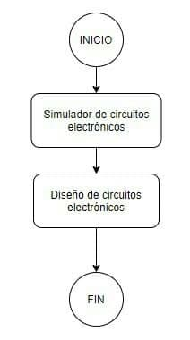

# Procesos de fabricación de los sistemas digitales

## Etapas de fabricación de un circuito impreso

En este video se especifica el proceso de fabricación, empezando por la obtención de la materia prima a partir de la arena, al extraer de esta el Silicio
componente que conforma el 25% de la capa terresetre de la tierra y utilizado para la creación de los semiconductores.

!?[Fabricación circuito impreso](https://www.youtube.com/watch?v=nBB_7RpQ9d0)

## Proceso de producción de una computadora

A continuación, se aprecia el proceso industrial sobre la creación y ensamble de las placas electrónicas que contienen las computadoras portatiles. Como lo son memorias, 
tarjeta madre y cargadores de alimentación.

!?[Producción de una computadora](https://www.youtube.com/watch?v=iExX3T70878)

Se pueden apreciar varias etapas:
- Creación de circuito impreso a partir de una baquela virgen.
- Inspección de circuito impreso (Máquina).
- Ubiación de los componentes sobre la placa.
- Inspección humana de correcta ubicación de componentes.
- Test de circuitos impresos uniendo todos los dispositivos que componen las computadoras portatiles.
- Linea de montaje de computadores portatiles.
- Test de envejecimiento, donde se lleva a la exigencia máxima del equipo para comprobar su fiabilidad.
- Área de empaque, para su posterior distribución.

# Herramientas de diseño

Para este proceso se requieren herramientas como las mostradas en la siguiente figura.

## Simulador de circuitos electrónicos

Se puede optar por las siguientes herramientas:

### Qucs

Es un simulador de circuitos electrónicos de código abierto cuya licencia de distribución es GNU GPL. Posee la capacidad de elaborar un circuito con una interfaz gráfica de usuario y simular el comportamiento del circuito en modo de gran señal, pequeña señal y con ruido eléctrico. Soporta además, la simulación de circuitos digitales usando VHDL y/o Verilog.

### gEDA

Es un entorno de software para la automatización de diseño electrónico, usado para el diseño de esquemas eléctricos, circuitos impresos y simulación.

### PCB EveryCircuit

En la plataforma Android tambien se consigue herramientas para la simulación de sistemas digitales, en la que se puede destacar **PCB EveryCircuit**

## Diseño de circuitos digitales

### KiCad EDA
Es un entorno de software usado para el diseño de circuitos eléctricos, muy flexible y adaptable, en el que se pueden crear y editar un gran número de componentes y usarlos en Eeschema. KiCad permite el diseño de circuitos impresos modernos de forma sencilla e intuitiva. Además, en Pcbnew, los circuitos se pueden diseñar con múltiples capas y ser visualizados en 3D.

# Usuarios

En los usuarios se deben tener en cuenta, las especificaciones requeridas para el dispositivo a crear. En los siguientes videos se puede apreciar ejemplos de aplicaciones en donde 
los sistemas digitales son el principal protagonista.

## La granja electrónica

!?[La granja electrónica](https://www.youtube.com/watch?v=wabvUC-CnKo)

De esta tecnología se están empezando a beneficiar los agricultores y por consecuente todos los humanos, ya que esto permite optimizar y tener mejor eficiencia en la calidad de sus productos. Liberando a los humanos de tareas repetitivas y que requieren de extrema dedicación.

## Almacén robotizado

!?[Almaceén automatizado](https://www.youtube.com/watch?v=wgBi1XDzI30)

El avance tecnologico ha permitido la automatización de procesos de distribución de almacenaje como en Amazon, gracias a el control colaborativo y a los sistemas digitales que 
contienen estos robots autónomos.
