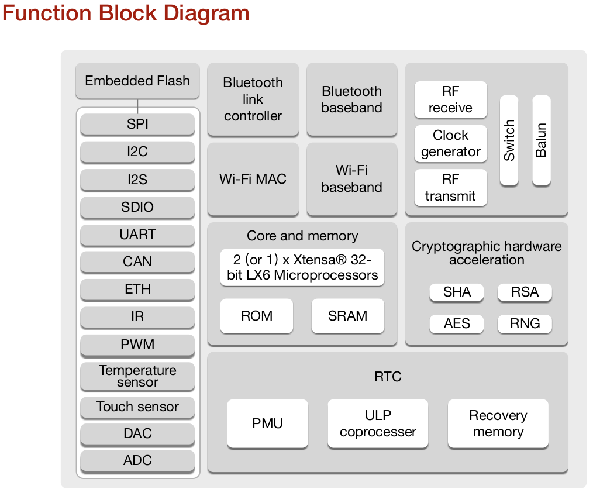

<!--

author: Carlos Camargo, Johnny Cubides

email: cicamargoba@unal.edu.co, jgcubidesc@unal.edu.co

comment: Material de apoyo para sistemas emebidos UNAL

-->

## Sistemas Embebidos


Proyecto
========

¿Qué queremos hacer?
====================

En nuestro curso lo que deseamos hacer es un producto terminado,
que esté orientado a la solución de una situación real.

¿Qué se debe entregar?
======================

* **Sistema embebido electrónico**
* **Caja**
* **Documentación**
* **Brochure comercial**

Sobre el sistema embebido
=========================

 

El dispositivo deberá responder a los requerimientos funcionales y no funcionales
y además tener las siguientes características:

* Desarrollar una PCB a la medida de la necesidad; podrá desarrollar el sistema embebido completo o desarrollar una tarjeta hija para una tarjeta de desarrollo
* Para las tareas de software se puede hacer uso de *Zephyr OS* o *Micropython*; si desea usar Micropython deberá ser compilado a la medida de la necesidad
* El sistema debe permitir la comunicación con otros dispositivos para monitoreo o control por parte del usuario final (puede ser a través de un medio guiado o no, lo cual depende de la aplicación).

Sobre la caja
=============

 

En este caso se refiere a los aparatos encargados de realizar las tareas mecánicas, de protección,
estéticas, de experiencia de usuario, las cuales contienen sensores, actuadores y el sistema diseñado;
puede hacer uso de CAD para impresión 3D, corte láser, existen bibliotecas libres en Internet que
podrá descargar y ajustar a la necesidad.

Sobre la documentación
----------------------

Queremos documentar el proceso de desarrollo, para tal fin puede se requiere hacer uso de:

* git
* Wiki

En primer lugar GIT es un sistema de gestión de versiones para proyectos de cualquier tipo que
permite seguirle la pista a nuestro proyectos de manera colaborativa; puede hacer uso de gestores
de repositorios de proyectos como *gitlab*, *github*, *bitbucket* o cualquier otro que conozca.

Con respecto a la Wiki, en realidad puede ser en cualquier lugar siempre y cuando muestre el proceso
realizado del proyecto como también el producto terminado con algún demo; los gestores de repositorios
de proyectos anteriormente mencionados tienen la posibilidad de crear wikis asociadas al proyecto, pero
también puede hacer uso de un blog o crear páginas web staticas (gitlab y github tienen esa propiedad y por ahora es libre)

Sobre el brochure
=================

Queremos que piensen que este producto va a ser ofrecido a un público que lo pueda necesitar por tanto
muestre el producto de tal manera que se pueda reconocer sus características y particularidades.


## Ideación

En esta face del proyecto queremos plantear lo que queremos hacer, como también las restricciones de funcionamiento y de alcance;
Para tal fin deseamos responder a los siguientes items:

* Descripción
* Requerimientos del cliente y alcance
* Requerimientos funcionales

Requerimientos del cliente y alcance
====================================

Son los relacionados a aquello que el cliente quiere que suceda con su producto, los cuales permiten juzgar
sin que éste necesariamente sepa como debe suceder internamente, para este paso, puede crear diagrámas que den cuenta
de como interviene el **"artefacto"** en la necesidad del cliente, como el usuario interactua con el aparato considerando
aspectos estéticos y aquello que tiene un valor agregado (experiencia de usuario), como sugerencia **Liste todo aquello que
permita acotar el alcance del proyecto** para que identifique que partes de eso se pueden realizar en el tiempo disponible
en el curso y aquello que queda proyectado para una próxima iteración del desarrollo del proyecto en otro espacio-tiempo.

Cronograma
==========

En construcción...

## Fabricación de PCB

Capacidad de desarrollo de PCB por parte de las empresas
========================================================


Es necesario conocer la técnología que usan las empresas en su proceso de fabricación para ahorrar costos,
conocer sus posibilidades y qué estándares existen.

La invitación en este caso es reconocer algunas variables importantes cuando emprendamos el ruteo:

* Tamaño mínimo recomendado de la pista (sin costo adicional)
* Tamaño de vías (perforaciones)
* Mínimo espacio entre pistas
* Costos en la creación de PCBs de uno y dos caras
* Panelización

Estas son las capacidades ofrecidas por algunas empresas:

* [Capacidades ofrecidas por JLCPCB](https://jlcpcb.com/capabilities/Capabilities)

### Normas de diseño IPC

Documentación de referencia sobre las normas IPC
------------------------------------------------

* [Normas IPC comprimido pdf de 41MB](https://drive.google.com/file/d/1sRoVv3UpkkW9lRWvpXItrszYJ7POOIxs/view?usp=sharing)
* [Normas IPC pdf de 177 MB](https://drive.google.com/file/d/1zWp61wTCGvVhFP5wHKmmkJQWqAea1irN/view?usp=sharing)

Vídeos sobre normas IPC
-----------------------

[Norma IPC 2221 para Circuitos Impresos Reglas eléctricas que debes seguir](https://www.youtube.com/watch?v=RiP0Z-NhS6M)

!?[Norma IPC](https://www.youtube.com/watch?v=RiP0Z-NhS6M)

Resistencias SMD
================

* [Resistencias de proposito general SMD pdf](https://github.com/johnnycubides/curso-scorm-sistemas-digitales/raw/main/ref-docs/datasheets/general/chip-resistor-smd-2167052.pdf)

Dimensiones resistencias
------------------------


Resistencia SMD en Kicad
------------------------

En el caso de que los componentes sean soldados con un cautin se recomienda no usar empaquetados pequeños, la recomendación
es seleccionar mínimo el empaquetado *0603* con la etiqueta de **handsolder**, observar la siguiente imagen de ejemplo:


### Componentes y fabricantes de PCBs

Fabricantes Internacionales
===========================

* [OSH Park (US)](https://oshpark.com/)

* [Eurocircuits (EU)](https://www.eurocircuits.com/)

* [Seeed Studio Fusion Service (China)](https://www.seeedstudio.com/fusion_pcb.html)

* [PCBWay (China)](https://www.pcbway.com/)

* [jlcpcb.com (China)](https://jlcpcb.com/)

* [allpcb.com (China)](https://www.allpcb.com/)

Fabricantes Nacionales
======================

* [Colcircuitos](https://colcircuitos.com/circuitos-impresos-servicios-integrales/)
* [Microensamble](https://microensamble.com)
* [PCBmicrocircuitos](https://pcbmicrocircuitos.com)

Tiendas componentes electrónicos
================================

* [Digikey](https://www.digikey.com/)
* [mouser](https://co.mouser.com)

## ESP32 consideraciones

El Esp32 es un SoC muy popular de bajo costo con periféricos como I2C, SPI, UART, ADC, DAC y de comunicación inalámbrica WiFi/Bluetooth.

 

Además del encapsulado del esp32 también se puede encontrar en módulos que contienen memorias, parche de antena (o conector para antena externa) y oscilador llamados *wroom* y *wrover* como se ven en la siguiente imagen


En este punto es importante observar los esquemas circuitales como los empaquetados de los módulos mencionados, por ejemplo observemos esta información para el **wroom**:


De las anteriores imágen ponga especial identifique donde se encuentra la antena, la memoria flash, el esp32 y el cristal oscilador.

Siguiendo la misma idea, ahora observe el empaquetado y el esquema circuital del módulo **wrover**, observe que este módulo además de tener los mismo componentes del anterior, se le ha agregado
un chip de SPRAM:


### Circuito de operación ESP32

Para el funcionamiento del esp32 en la PCB a construir se requiere un circuito adicional ya que el esp32 se puede configurar para que opere en dos modos principales: **flash** y **boot**.

* **Modo flash**: permite escribir la memoria flash que está en el 
* **modeo boot**: El esp32 ejecuta el programa que tiene almacenado en la memoria flash

Circuito requerido para poner en operación los módulos *wrover* o *wroom*:


### Documentación de referencia

* [Página de documentos técnicos del esp32](https://www.espressif.com/en/support/documents/technical-documents)
* [Manual técnico del esp32](https://www.espressif.com/sites/default/files/documentation/esp32_technical_reference_manual_en.pdf)
* [Guia de diseño esp32](https://www.espressif.com/sites/default/files/documentation/esp32_hardware_design_guidelines_en.pdf)
* [Datasheet esp32 **wroom**](https://www.espressif.com/sites/default/files/documentation/esp32-wroom-32_datasheet_en.pdf)
* [Datasheet esp32 **wrover**](https://www.espressif.com/sites/default/files/documentation/esp32-wrover_datasheet_en.pdf)
* [Framework de desarrollo de esp](https://github.com/espressif/esp-idf)
* [Documentación de uso de esp32](https://docs.espressif.com/projects/esp-idf/en/latest/esp32/index.html)

## Herramientas

* GIT
* KiCAD
* Zephyr
* Drawio

### GNU/Linux

Comando útiles
==============

|Comando  |Acción |Ejemplo  |
|:-------------:|:-------------:|:-----:|
|`pwd`  | Posición absoluta actual en el árbol de directorios ||
|`cat`  | Imprimir en pantalla el contenido de un archivo | cat README.md |
|`mkdir`  | Crear un directorio en el lugar especificado  | mkdir directorio  |
|`mkdir -p` | Crear un directorio vacio con su respectivo padre | mkdir -p ./directorioPadre/directorioHijo |
|`ls` | Listar el contenido de un directorio | ls, ls -ltrh |
|`cd` | Entrar a un directorio  | cd directorio |
|`cd ..`  | Subir un nivel en el árbol de directorio||
|`rm` | Remover un archivo  | rm archivo.txt  |

Rutas Linux
===========


MAKE
====

```bash
sudo apt install make
```

[Tutorial Makefile](https://makefiletutorial.com)

[Makefile pdf en español](https://github.com/johnnycubides/curso-scorm-sistemas-digitales/raw/main/ref-docs/books/make.pdf)

### GIT


INSTALACIÓN DE GIT
==================

```sh
sudo apt install git
```

CONFIGURACIÓN DE GIT
====================

```bash
git config --global user.name "Johnny Cubides"
git config --global user.email nombre@dominio.com
git config --global core.editor nvim
git config --list
```

CONFIGURAR LLAVE SSH (OPCIONAL)
===============================

Creando llave
-------------

```bash
ssh-keygen -t rsa -b 4096 -C "ETIQUETA"
```
> La ETIQUETA puede ser tu correo electrónico

A continuación la terminal te pedirá un nombre para guardar el archivo con la llave,
ejemplo:

```bash
Enter file in which to save the key (/home/johnny/.ssh/id_rsa): /path/nombre-archivo
```

> Usa un **nombre-archivo** representativo

Agregar la llave al agente
--------------------------

```bash
ssh-add ~/.ssh/nombre-archivo
```

> Si el agente no está activo lo puedes lanzar con el siguiente comando:
> `eval "$(ssh-agent -s)"`

CLONAR UN REPOSITTORIO
======================

```sh
git clone nombre-de-repositorio
```

HACER UN PULL
=============

La acción de **pull** realiza primero una búsqueda y trae al repositorio local los cambios que hayan sido realizados en el repositorio remoto.

```bash
git pull
```

> Recomiendo que antes de empezar a trabajar se realice un pull en el repositorio local para tener siempre los últimos cambios
> reportados por los demás compañeros.


HACER UN PUSH
=============

La acción de PUSH lleva los cambios del repositorio local al repositorio remoto alojado en un servidor de GIT,
Para que esta operación sea válida se requiere realizar los siguientes pasos:

1. Agregar los archivos con cambios que serán enviados con **git add**
2. Para cometer el push se requiere realizar un comentario sobre los cambios a subir al repositorio remoto de GIT
3. Se realiza el **push** para llevar los cambios
> Se recomienda que se trabaje en directorios específicos para no crear conflictos con cambios que hayan realizado otros
> compañeros y que no se hayan tenido en cuenta.

```bash
git add .
git commit -m "comentario del commit"
git push
```

DOCUMENTACIÓN DE REFERENCIA DE GIT
==================================

* [Libro Pro Git en pdf](https://github.com/johnnycubides/curso-scorm-sistemas-digitales/raw/main/ref-docs/books/progit.pdf): Aprede a usar Git de manera profesional, el libro es de distribución libre en lenguaje español.

### KiCAD


INSTALACIÓN DE KITCAD
---------------------

`sudo apt install kicad`

ACCESOS RÁPIDOS
---------------

|Comando  |Explicación  |
|:-------------:|:-------------:|
| | |

Mi primer PCB con kicad
-----------------------

* [Make Your First Printed Circuit Board](https://www.build-electronic-circuits.com/kicad-tutorial/?fbclid=IwAR3OwgRqwc85H-j0YJTUkhBbJpkR1eex80cYIkS15KJx4cIzqhzl-UpF0DQ): Este tutroial en idioma inglés acerca al estudio de la herramienta de diseño *kicad* mientras crea su primera PCB.


Ejercicios de routeo
--------------------


* [flow free](https://www.bigduckgames.com/flowfree): Para desarrollar la habilidad de routeo, puede realizar hacer uso de la herramienta **flow free** la cualnos reta a pensar la manera correcta de conectar nodos de colores a través de puentes, la herramienta está compilada en distintas tiendas.


### Zephyr OS


### Drawio


## Proyectos

Proyectos Sistemas Embebidos UNAL 2022-I
========================================

**En proceso...**

Proyectos Sistemas Embebidos UNAL 2021-II
=========================================

Enlaces de los repositorios del proyectos
-----------------------------------------

* [Github del proyecto: Telemetría apícola](https://github.com/Norely/Telemetria-apicola)
* [Github del proyecto: Termómetro cervercero](https://github.com/Dportela2001/RemoteTempMonitor)
* [Github del proyecto: Control de biosistemas](https://github.com/DaryhenViancha/Control-de-biosistemas)
* [Github del proyecto: Control de aforo](https://github.com/screinac/controlador-de-aforo)
* [Github del proyecto: Cuidador de mascotas](https://github.com/Davidariza99/Proyecto-embebidos)
* [Github del proyecto: Dispensador para mascotas](https://github.com/AndresRodriguezUN/Dispensador-de-Comida-para-mascotas)
* [Github del proyecto: Cerradura electrónica](https://github.com/CamSP/cerradura-electronica)
* [Github del proyecto: Monitor bodega](https://github.com/Grupo-Monitor-Bodega)

Vídeos de las presentaciones de los proyectos
---------------------------------------------

!?[Telemetría Apícola](https://youtu.be/vyEqwwPkpSk)

!?[Termómetro cervercero](https://youtu.be/wNGFhHlYesc)

!?[Control de biosistemas](https://youtu.be/OPwyoVEpBv4)

!?[Control de aforo](https://youtu.be/n9p1b5t7SQs)

!?[Cuidador de mascotas](https://youtu.be/NZSnmj3M8_A)

!?[Dispensador para mascotas](https://youtu.be/8CSYblkC2kM)

!?[Cerradura electrónica](https://youtu.be/EMLXIH5TPao)

!?[Monitor bodega](https://youtu.be/-TkDQ2qM4i0)

