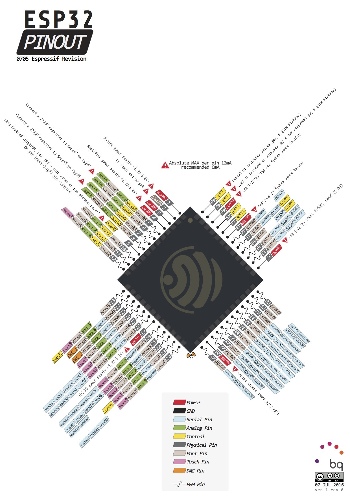
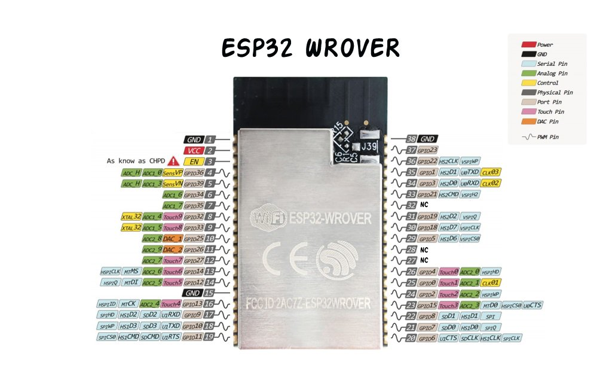
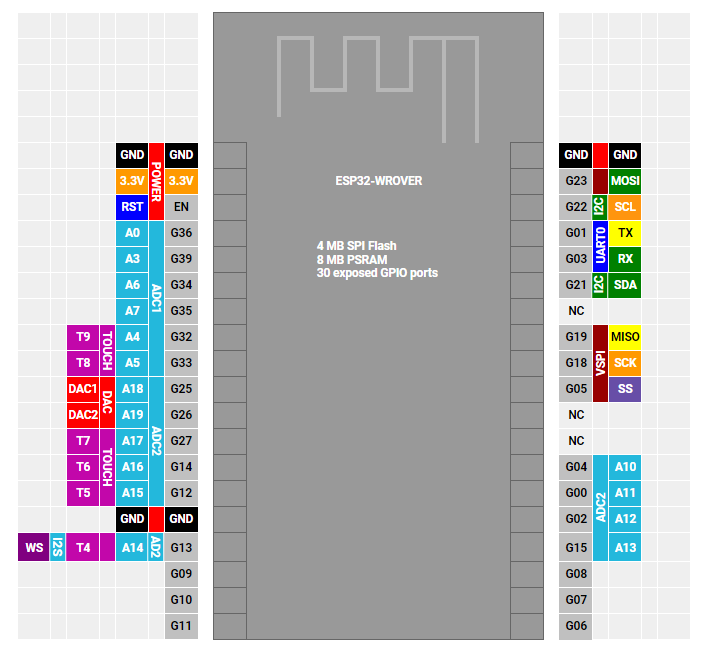
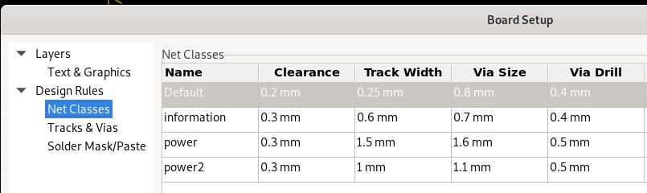
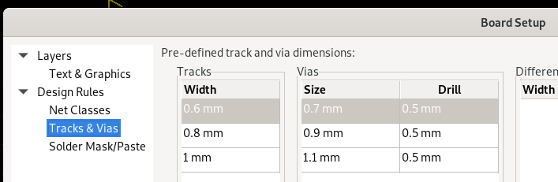

<!--

author: Carlos Camargo, Johnny Cubides

email: cicamargoba@unal.edu.co, jgcubidesc@unal.edu.co

comment: Material de apoyo para sistemas emebidos UNAL

version: 0.2.0

blue: true 

script: ./pdfobject.min.js
        ./pdfobject.js

-->

## Sistemas Embebidos UNAL

[Plan de estudios (CDIO) Sistemas Embebidos en pdf](https://github.com/johnnycubides/curso-scorm-sistemas-digitales/raw/main/ref-docs/camargo-docs/CDIO.pdf)

Proyecto
========

A continuación verá un esquema que representa las diferentes fases/tareas del desarrollo del un proyecto en el curso de sistemas embebidos:


¿Qué queremos hacer?
====================

En nuestro curso lo que deseamos hacer es un producto terminado,
que esté orientado a la solución de una situación real.

¿Qué se debe entregar?
======================

* **Sistema embebido electrónico**
* **Caja**
* **Documentación**
* **Brochure comercial**

Sobre el sistema embebido
=========================

 

El dispositivo deberá responder a los requerimientos funcionales y no funcionales
y además tener las siguientes características:

* Desarrollar una PCB a la medida de la necesidad; podrá desarrollar el sistema embebido completo o desarrollar una tarjeta hija para una tarjeta de desarrollo
* Para las tareas de software se puede hacer uso de *Zephyr OS* o *Riot OS*.
* El sistema debe permitir la comunicación con otros dispositivos para monitoreo o control por parte del usuario final (puede ser a través de un medio guiado o no, lo cual depende de la aplicación).

Sobre la caja
=============

 

En este caso se refiere a los aparatos encargados de realizar las tareas mecánicas, de protección,
estéticas, de experiencia de usuario, las cuales contienen sensores, actuadores y el sistema diseñado;
puede hacer uso de CAD para impresión 3D, corte láser, existen bibliotecas libres en Internet que
podrá descargar y ajustar a la necesidad.

Sobre la documentación
----------------------

Queremos documentar el proceso de desarrollo, para tal fin puede hacer uso de:

* git
* Wiki

En primer lugar GIT es un sistema de gestión de versiones para proyectos de cualquier tipo que
permite seguirle la pista a nuestro proyectos de manera colaborativa; puede hacer uso de gestores
de repositorios de proyectos como *gitlab*, *github*, *bitbucket* o cualquier otro que conozca.

Con respecto a la Wiki, en realidad puede ser en cualquier lugar siempre y cuando muestre el proceso
realizado del proyecto como también el producto terminado con algún demo; los gestores de repositorios
de proyectos anteriormente mencionados tienen la posibilidad de crear wikis asociadas al proyecto, pero
también puede hacer uso de un blog o crear páginas web staticas (gitlab y github tienen esa propiedad y por ahora es libre)

Sobre el brochure
=================

Queremos que piensen que este producto va a ser ofrecido a un público que lo pueda necesitar por tanto
muestre el producto de tal manera que se pueda reconocer sus características y particularidades.

Ejemplo de brochure:


## Ideación

En esta face del proyecto queremos plantear lo que queremos hacer, como también las restricciones de funcionamiento y de alcance;
Para tal fin deseamos responder a los siguientes items:

* Descripción
* Requerimientos del cliente y alcance
* Requerimientos funcionales
* Experiencia de usuario

Requerimientos del cliente y alcance
====================================

Son los relacionados a aquello que el cliente quiere que suceda con su producto, los cuales permiten juzgar
sin que éste necesariamente sepa como debe suceder internamente, para este paso, puede crear diagrámas que den cuenta
de como interviene el **"artefacto"** en la necesidad del cliente, como el usuario interactua con el aparato considerando
aspectos estéticos y aquello que tiene un valor agregado (experiencia de usuario), como sugerencia **Liste todo aquello que
permita acotar el alcance del proyecto** para que identifique que partes de eso se pueden realizar en el tiempo disponible
en el curso y aquello que queda proyectado para una próxima iteración del desarrollo del proyecto en otro espacio-tiempo.

Cronograma
==========

El cronograma que desee diseñar para realizar su proyecto puede ser referenciado con el el diagrama de fases/tareas propuesto
en esta documentación en [este enlace](#Sistemas-Embebidos-UNAL)

## ¿Qué es un sistema embebido?

Antes de definir el sistema embebido, se invita o hacer una revisión de la siguiente presentación del que da una idea sobre los
[paradigmas de diseño de los SoC](https://github.com/johnnycubides/curso-scorm-sistemas-digitales/raw/main/ref-docs/otros/nuevos_paradigmas_de_disenio.pdf).

Realizada la ubicación de los paradigmas de diseño se puede aproximar a la definición de los sistemas digitales haciendo lectura del documento
[Implementación de la Metodologı́a de Transferencia Tecnológica Propuesta en el diseño de Sistemas Embebidos, paginas 1-5, 14-16](https://github.com/johnnycubides/curso-scorm-sistemas-digitales/raw/main/ref-docs/camargo-docs/Implementacion-metodologia-transferencia-tecnologica-SE.pdf).

También puede acompañar la anterior lectura con el siguiente
[resumen técnico sobre la metodologia de diseño de sistemas embebidos en las páginas 7-10 del PDF](https://github.com/johnnycubides/curso-scorm-sistemas-digitales/raw/main/ref-docs/camargo-docs/metodologia-de-diseno-SE-camargo.pdf).

Metodología de diseño para el área de Sistemas Digitales
========================================================

Con las lecturas anteriormente recomendadas podrá analizar el siguiente gráfico que se observa en el documento de [CDIO](https://github.com/johnnycubides/curso-scorm-sistemas-digitales/raw/main/ref-docs/camargo-docs/CDIO.pdf) pagina xx
que explica como se relaciona los cursos de electrónica digital ofrecidos en la Universidad Nacional de Colombia; podrá ubicar en
él qué se implementa en el curso de Sistemas embebidos.


Los siguientes gráficos dan cuenta de los elementos claves en sistemas embebidos que son señalados en las lecturas anterioemente
recomendadas.

Flujo de diseño de un sistema embebebido
========================================


Arquitectura de un Sistema Embebido
===================================


Arquitectura de un sistema embebido comercial con memoria interna
=================================================================


Arquitectura de un sistema embebido comercial con memoria externa
=================================================================


Flujo de diseño para aplicaciones un sistema embebido
=====================================================


Ejemplo de flujo de diseno para crear un aplicación en un procedador softcore
=============================================================================


### ESP32 consideraciones

El Esp32 es un SoC muy popular de bajo costo con periféricos como I2C, SPI, UART, ADC, DAC y de comunicación inalámbrica WiFi/Bluetooth.

 

Además del encapsulado del esp32 también se puede encontrar en módulos que contienen memorias, parche de antena (o conector para antena externa) y oscilador llamados *wroom* y *wrover* como se ven en la siguiente imagen


En este punto es importante observar los esquemas circuitales como los empaquetados de los módulos mencionados, por ejemplo observemos esta información para el **wroom**:


De las anteriores imágen ponga especial identifique donde se encuentra la antena, la memoria flash, el esp32 y el cristal oscilador.

Siguiendo la misma idea, ahora observe el empaquetado y el esquema circuital del módulo **wrover**, observe que este módulo además de tener los mismo componentes del anterior, se le ha agregado
un chip de SPRAM:


#### Circuito de operación ESP32

Para el funcionamiento del esp32 en la PCB a construir se requiere un circuito adicional ya que el esp32 se puede configurar para que opere en dos modos principales: **flash** y **boot**.

* **Modo flash**: permite escribir la memoria flash que está en él 
* **modeo boot**: El esp32 ejecuta el programa que tiene almacenado en la memoria flash

Circuito requerido para poner en operación los módulos *wrover* o *wroom*:


#### Pinout ESP32 (Soc y módulos)

Pinout ESP32 SOC
=================



Pinout ESP32 WROOM
==================


Pinout ESP32 WROVER
===================





#### Documentación de referencia

Documentación técnica ESP32
===========================
* [Datasheet esp32 `*`](https://www.espressif.com/sites/default/files/documentation/esp32_datasheet_en.pdf)
* [Página de documentos técnicos del esp32](https://www.espressif.com/en/support/documents/technical-documents)
* [Manual técnico del esp32](https://www.espressif.com/sites/default/files/documentation/esp32_technical_reference_manual_en.pdf)
* [Guia de diseño esp32](https://www.espressif.com/sites/default/files/documentation/esp32_hardware_design_guidelines_en.pdf)
* [Datasheet esp32 **wroom**](https://www.espressif.com/sites/default/files/documentation/esp32-wroom-32_datasheet_en.pdf)
* [Datasheet esp32 **wrover**](https://www.espressif.com/sites/default/files/documentation/esp32-wrover_datasheet_en.pdf)
* [Framework de desarrollo de esp](https://github.com/espressif/esp-idf)
* [Documentación de uso de esp32](https://docs.espressif.com/projects/esp-idf/en/latest/esp32/index.html)

**NOTAS**:

`*` En la página 62 se observa información sobre el estado inicial de algunos pines (pull up o pull down en wake up), para tenerlo en cuenta si los llegara a usar en su diseño.

Esquemáticos de referencia tarjetas de desarrollo con ESP32
===========================================================

* [Ai-Thinker NodeMCU esp32 wroom](https://github.com/johnnycubides/curso-scorm-sistemas-digitales/raw/main/ref-docs/example-schematics/schematics-esp32-ref/Ai-Thinker_NodeMCU-esp32-wroom.png)
* [LiyGo esp32 wrover](https://github.com/johnnycubides/curso-scorm-sistemas-digitales/raw/main/ref-docs/example-schematics/schematics-esp32-ref/LilyGo-esp32-wrover.pdf)
* [Wemos esp32 wroom](https://github.com/johnnycubides/curso-scorm-sistemas-digitales/raw/main/ref-docs/example-schematics/schematics-esp32-ref/wemos-esp32-wroom.png)
* [Father esp32 wroom](https://github.com/johnnycubides/curso-scorm-sistemas-digitales/raw/main/ref-docs/example-schematics/schematics-esp32-ref/feather-esp32-wroom.png)
* [Esp32-cam v1.6](https://github.com/johnnycubides/curso-scorm-sistemas-digitales/raw/main/ref-docs/example-schematics/schematics-esp32-ref/ESP32_CAM_V1.6.pdf)
* [M5Stack esp32 soc](https://github.com/johnnycubides/curso-scorm-sistemas-digitales/raw/main/ref-docs/example-schematics/schematics-esp32-ref/m5stack-esp32-soc.pdf)
* [Sparkfun esp32 soc](https://github.com/johnnycubides/curso-scorm-sistemas-digitales/raw/main/ref-docs/example-schematics/schematics-esp32-ref/sparkfun-esp32-soc.pdf)
* [tft esp32 soc](https://github.com/johnnycubides/curso-scorm-sistemas-digitales/raw/main/ref-docs/example-schematics/schematics-esp32-ref/tft-esp32-soc.pdf)

## Diseño y fabricación de PCB

El proceso de diseño y fabricación es uno de los procesos que tiene
un nivel de complejidad importante y de revisión minuciosa, es posible que haya que realizar
varias iteraciones en cada uno de los pasos en el flujo de diseño. Para dimensionar mejor
los resultados posibles como los problemas a enfrentar se invita a ver el siguiente
vídeo y reflexionar sobre cada una de las situaciones mostradas.

!?[Construimos Un SMARTWATCH (Nada Fácil)](https://youtu.be/GC0GuNWkyHg)

A continuación se ponen algunas preguntas orientadoras para iniciar la discusión y la
reflexión.

* ¿Cómo dimensionar las capacidades del circuito de energización del sistema?
* ¿Cuales son las consideraciones de tamaño y de ubicación de los componentes del sistema?
* ¿Qué tipo de conectores se deben utilizar?
* ¿Cómo se soldarán los componentes del sistema?
* ¿Qué cosas se pueden dañar y requieren sistemas de protección?

Finalmente se comparte el flujo de diseño que le permitirá además de indagar, ubicarse
en el proceso de diseño y fabricación y los detalles a tener en cuenta.


### Normas de diseño IPC

Documentación de referencia sobre las normas IPC
------------------------------------------------

* [Normas IPC comprimido pdf de 41MB](https://drive.google.com/file/d/1sRoVv3UpkkW9lRWvpXItrszYJ7POOIxs/view?usp=sharing)
* [Normas IPC pdf de 177 MB](https://drive.google.com/file/d/1zWp61wTCGvVhFP5wHKmmkJQWqAea1irN/view?usp=sharing)

Vídeos sobre normas IPC
-----------------------

[Norma IPC 2221 para Circuitos Impresos Reglas eléctricas que debes seguir](https://www.youtube.com/watch?v=RiP0Z-NhS6M)

!?[Norma IPC](https://www.youtube.com/watch?v=RiP0Z-NhS6M)

### Diseño de esquemático

Con respecto al diseño del esquemático del circuito para un sistema embebido, se plantea el desarrollo en la herramienta KiCAD
con hojas jerárquicas.

A continuación se comparte un esquemático con un diseño jerárquico el cual permite el estudio de distintas herramientas
usadas en KiCAD.

[Ejemplo de esquemático para un sistema embebido usando el módulo esp8266 en PDF](https://github.com/johnnycubides/curso-scorm-sistemas-digitales/raw/main/ref-docs/example-schematics/luna-esp8266.pdf)

Tenga en cuenta lo siguiente para su diseño
===========================================

* Realice un diseño jerárquico.
* Diseñe los agujeros de sujeción del sistema embebido a la caja.
* Haga uso de las recomendaciones de conexión de los datasheets.
* Cuando agregue elementos de Bypass como es el caso de los condensadores ubicarlos junto a los elementos indicados pues deben quedar lo más cerca entre ellos en el ruteo (como se indique en datasheet).
* No olvide agregar otros sistemas de protección para el sistema en contra de corrientes parásitas, estáticas y demás, hay dispositivos en el mercado construidos para ello, como arreglos de diodos, inductancias capacitores, etc.
* Los circuitos Analógicos son distintos a los circuitos digitales y deben desacoplarse para no generar interferencia entre ellos, reconozca métodos para realizar tal procedimiento si lo requiere su diseño.
* Agregue un LED de energización del sistema embebido
* Agregue un LED de usuario para hacer el "hello world"
* Use conectores apropiados para sus periféricos, recuerde que puede ser pin headers, Molex, JST, RJx, Jacks, Grove entre otros.
* Tenga presente que algunos componentes pueden requerir mucha potencia y disipar calor, haga las anotaciones para que se refleje esta información en el ruteo.
* Haga uso de reguladores LDO que son diseñados con el  propósito de sacar el mejor provecho a sus fuentes de alimentación, consulte la siguiente información de [digikey sobre LDO](https://www.digikey.com/es/articles/use-advanced-ldos-iot-wireless-sensor-power-supply-design)
* Aunque estos sistemas por definición son diseñados a la medida, puede agregar algún puerto que le de flexibilidad al sistema, por ejemplo, un puerto adicional de i2c o de spi, podría permitirle agregar sensores y actuadores  que puede incorporar a la hora de verificar y validar los requerimientos funcionales y no funcionales si en principio no fueron satisfechos, de hecho, en esta etapa donde se crea el primer demo, suele ser estratégico tener esta flexibilidad. 

### Recomendaciones sobre el footprint

Resistencias SMD
================

* [Resistencias de proposito general SMD pdf](https://github.com/johnnycubides/curso-scorm-sistemas-digitales/raw/main/ref-docs/datasheets/general/chip-resistor-smd-2167052.pdf)

Dimensiones resistencias
------------------------


Resistencia SMD en Kicad
------------------------

En el caso de que los componentes sean soldados con un cautin se recomienda no usar empaquetados pequeños, la recomendación
es seleccionar mínimo el empaquetado *0603* con la etiqueta de **handsolder**, observar la siguiente imagen de ejemplo:


### Recomendaciones sobre el ruteo

El ruteo consisten en crear los caminos de conexión de los diferentes componentes teniendo en cuenta
el esquemático eléctrico

Tenga en cuenta lo siguiente para el ruteo
==========================================

* Use una capa para general los márgenes de su sistema, así podrá ubicar los componentes en el espacio delimitado
* Las empresas de fabricación de PCB usan unos valores estandar para el tamaño de estas, por ejemplo, en algunas empresas si la placa es de un tamaño de 10cm x 10cm puede obtener un descuento considerable. 
* Ubique los componetes de conexión en lugares accesibles, generalmente son ubicados en los laterales de la placa
* Recordando las recomendaciones del fabricante de un dispositivo haga el ejercicio de ubicación, por ejemplo, un módulo esp32 hace indicaciones sobre su huella para favorecer su optimo funcionamiento.
* Si tiene componentes que disipan calor, revise el datasheet y ubique el componente dando el espacio suficiente o el footprint necesario para tal fin.
* También cuenta con capas de corte en kicad, las puede usar por ejemplo si desea separar zonas de tensión DC de bajo voltaje con las zonas AC de alta baja tensión (110 V o 220 V).
* Los componentes se ubican en sectores para separarlos según su funcionalidad: (potencia, comunicación, alta frecuencia, digitales, análogicos, instrumentación) tenga en cuenta las recomendaciones de las normas.
* Haga uso de máximo dos caras de conexión en la PCB (cara frontal y cara trasera) 
* Haga uso de componentes SMD (soldadura superficial) de manera general, para casos específicos haga uso de THD (True Hold), ejemplo: resistencias, condensadores y otros chips en montaje SMD, resistencias de calor y conectore s THD.
* Si hace uso de componentes THD, haga los caminos por la cara trasera ya que estos componentes se ubican generalmente en la cara frontal dejando como lugar de soldadura la cara trasera.
* Trate de ubicar todos los componentes SMD y THD en la cara frontal; lo anterior tiene como beneficio que cuando se construyen placas en serie es un factor para reducir costos.
* Recuerde las recomendaciones que realizó en el esquemático que diseño, por ejemplo, la ubicación cercana de los elementos usados como bypass y protecciones
* Tenga en cuenta que existen rutas que son usadas para compartir energía y otras para compartir información, al identificarlas, tenga presente los tamaños de esas rutas, es decir, no es lo mismo una pista que sirve para transportar unos micro-amperios, que aquellas rutas destinadas a circular por ellas un amperio.
* Del mismo modo que pasa con las pistas, debe tener las consideraciones necesarias para las vías; mientras que las pistas son aquellas que unen componentes en una cara, las vías son aquellos puentes eléctricos que unen las caras, las vías son cilindros huecos entre ellas.
* Así como fue pensado en el esquemático, la serigrafía indica qué componente va en cada huella, de ese modo, mueva la serigrafía de cada footprint en un lugar visible, el cual no genere ambigüedades al momento de ubicar un componente, piense que habrá una persona diferente a usted que pondrá los componentes y que es necesario tener un marcado limpio de los footprint para no equivocarse al soldar.
* La serigrafía cumple un papel importante, por ejemplo, si tenemos un puerto de conexión para la programación a través de conectores rápidos, cada pin debe estar marcado inequívocamente, por ejemplo, indicaciones de polarización de la placa para no quemar componentes, construya placas donde se expliquen sus entradas, salidas, enlace a la documentación e indicaciones.
* Rutee las conexiones correspondientes a señales y potencia, con respecto a GND no realice ningún ruteo.
* El ruteo de GND se hace a través de la creación de zonas en las caras frontal y trasera, si existen zonas de GND que quedan aisladas como islas de otras zonas GND haga uso de la creación de vías para interconectar zonas entre caras.
* Evite la creación de placas paralelas que se puedan comportar como capacitores, para este caso, haga uso también de vías para fortaleces la referencia de GND. 
* Tenga presenta la ubicación adecuada de los agujeros de sujeción; estos agujeros permitirán empotrar el sistema a la caja. 

Recomendaciones con relación a las vías y pistas
================================================

Como se mencionó en las recomendaciones de ruteo, se tienen los siguientes elementos de conexión:

* Vias: Permite a través de cilindros huecos conectar diferentes caras de una PCB.
* Pistas: Conecta distintos componentes de una misma cara.

Estas configuraciones son posibles en KiCad como se muestra a continuación, a demás, estos valores pueden
ser usados como referencia para sus propios diseños:

Creación de clases para vias y pistas
-------------------------------------




Creación manual de vías y pistas
--------------------------------



Modificación de vías y tracks cuando ya se hayan realizado
----------------------------------------------------------

Cuando hayan realizado el ruteo de las pistas y quieran cambiar el tamaño a todas según las clases pueden hacer uso de la explicación en [este enlace](https://electronics.stackexchange.com/questions/378394/update-tracks-on-board-to-reflect-new-design-rules-kicad) y kicad las cambiará todas automáticamente

### Fabricación de PCB

Capacidad de desarrollo de PCB por parte de las empresas
========================================================


Es necesario conocer la técnología que usan las empresas en su proceso de fabricación para ahorrar costos,
conocer sus posibilidades y qué estándares existen.

La invitación en este caso es reconocer algunas variables importantes cuando emprendamos el ruteo:

* Tamaño mínimo recomendado de la pista (sin costo adicional)
* Tamaño de vías (perforaciones)
* Mínimo espacio entre pistas
* Costos en la creación de PCBs de uno y dos caras
* Panelización

Estas son las capacidades ofrecidas por algunas empresas:

* [Capacidades ofrecidas por JLCPCB](https://jlcpcb.com/capabilities/Capabilities)

Fabricantes Internacionales de PCB
==================================

* [OSH Park (US)](https://oshpark.com/)

* [Eurocircuits (EU)](https://www.eurocircuits.com/)

* [Seeed Studio Fusion Service (China)](https://www.seeedstudio.com/fusion_pcb.html)

* [PCBWay (China)](https://www.pcbway.com/)

* [jlcpcb.com (China)](https://jlcpcb.com/)

* [allpcb.com (China)](https://www.allpcb.com/)

Fabricantes Nacionales de PCB
=============================

* [Colcircuitos](https://colcircuitos.com/circuitos-impresos-servicios-integrales/)
* [Microensamble](https://microensamble.com)
* [PCBmicrocircuitos](https://pcbmicrocircuitos.com)

Tiendas componentes electrónicos
================================

* [Digikey](https://www.digikey.com/)
* [mouser](https://co.mouser.com)


## Herramientas

* GIT
* KiCAD
* Zephyr
* Drawio

### GNU/Linux

El sistema operativo GNU/Linux es un clone de UNIX, UNIX es el sistema operativo padre de otros sistemas operativos
actualmente usados por ejemplo MacOS, Solaris, FreeBSD entre otros, conocer de manera general a UNIX es encontrar
coincidencias en la forma y uso de los sistemas operativos mencionados. A continuación se comparte un
pdf de 24 páginas que muestra de manera general sus principales características.

[Apuntes UNIX en PDF](https://github.com/johnnycubides/curso-scorm-sistemas-digitales/raw/main/ref-docs/books/linux/unix.pdf)

Llegar por primera vez a un sistema operativo como lo es "Linux" es un reto que requiere esmero y dedicación, se invita a tener la siguiente
referencia en PDF la cual podrá consultar de vez en cuando, y que a través de las prácticas propuestas, podrá mejorar el desempeño en el uso
de este gran sistema operativo como lo es GNU/Linux.

[Sistema operativo Linux (teoría y práctica) en PDF](https://github.com/johnnycubides/curso-scorm-sistemas-digitales/raw/main/ref-docs/books/linux/linux.pdf)

Se recomienta también tener el siguiente libro de referencia escrito en inglés sobre las funciones de Linux.

[How Linux Works What Every Superuser Should Know en PDF](https://github.com/johnnycubides/curso-scorm-sistemas-digitales/raw/main/ref-docs/books/linux/HowLinuxWorks.pdf)

Comando útiles
==============

Para tener mayor claridad sobre el mundo de los comandos en Linux tenga de referencia el siguiente libro que le permitirá conocer las combinaciones de los comandos y argumentos según su necesidad.

[The Linux Comman Line en PDF](https://github.com/johnnycubides/curso-scorm-sistemas-digitales/raw/main/ref-docs/books/linux/TLCL-19.01.pdf)

[Sitio oficial del libro](https://linuxcommand.org/index.php)

Los comandos presentados en la siguiente tabla se ejecutan en una terminal de Linux.

|Comando  |Acción |Ejemplo  |
|:-------------:|:-------------:|:-----:|
|`pwd`  | Posición absoluta actual en el árbol de directorios | `pwd` |
|`cat`  | Imprimir en pantalla el contenido de un archivo | `cat README.md` |
|`mkdir`  | Crear un directorio en el lugar especificado  | `mkdir directorio`  |
|`mkdir -p` | Crear un directorio vacío con su respectivo padre | `mkdir -p ./directorioPadre/directorioHijo` |
|`ls` | Listar el contenido de un directorio | `ls -ltrh` |
|`ln -s`| Crea enlaces simbólicos (en Windows accesos directos) para ficheros | `ln -s /path/archivoFuente /path/archivoDestino` |
|`cd` | Entrar a un directorio  | `cd directorio` |
|`cd ..`  | Subir un nivel en el árbol de directorio| `cd ../` |
|`rm` | Remover un archivo  | `rm archivo.txt` |
|`rm -r`| Remover ficheros de manera recursiva | `rm -r directorio/` |
|`cp`| Hacer copias de ficheros | `cp path/directorio path/copia` |
|`mv`| Mover fichero a nuevoPath/ | `mv archivo pathDestino/` |
|`mv`| Cambiar el nombre de un fichero | `mv archivo nuevoNombreArchivo` |
|`grep`| Buscar una coincidencia dentro de los ficheros | `grep -lr "palabraCoincidencia" path/` |
|`find`| Encontrar un archivo en alguna ruta | `find -iname ./ "parteDelNombreDelArchivoAEncontrar*"`|


GESTORES DE PAQUETES
====================

En "Linux" existen maneras distintas para instalar un programa, entre ellas:

* **Compilar desde archivos fuentes**: se requiere tener los archivos fuentes, reglas de compilación pueden estar basadas en [Make](https://es.wikipedia.org/wiki/Make), compiladores y librerías como parte de las dependencias de compilación.
* **Aplicaciones empaquetadas**: En este caso se obtiene un archivo que se desempaquetará y se instalará en el sistema linux sin requerir el compilador, en el caso de las Distribuciones basadas en "Debian" los paquetes son de extensión **.deb**.
* **Gestores de paquetes**: Las distribuciones Linux tienen servidores en la nube con las aplicaciones empaquetadas para distintas arquitecturas, a través de un cliente instalado en la computadora instalará el paquete con sus dependencias.

Para el caso de Debian se hace uso de algunos gestores de paquetes que facilitan el proceso de instalación de los programas; tal es el caso de **apt**, **apt-get** o **aptitude**.

A continuación se explica el proceso de uso **apt**:

|Comando| Observación |
|:-------------:|:-------------:|
| `apt update` | Actualiza los apuntadores de los sources list para que pueda encontrar los servidores donde están los paquetes de los programas |
| `apt install paquete` | Permite instalar una aplicación con la opción de aceptar algunas condiciones como por ejemplo instalación de dependencias |
| `apt install -f` | Tratará de reparar el funcionamiento de una aplicación a través de por ejemplo la instalación de dependencias rotas, sino lo logra, es posible que desinstale la aplicación y se requiera un procedimiento manual |
| `apt remove paquete` | Desinstala un paquete |


SHELL
=====

En construcción...

MAKE
====

```bash
sudo apt install make
```

[Tutorial Makefile](https://makefiletutorial.com)

[Make en español en PDF](https://github.com/johnnycubides/curso-scorm-sistemas-digitales/raw/main/ref-docs/books/make.pdf)

### GIT


A continuación se diagrama la funcionalidad del sistema distribuido de control de versiones **git**.


Para conocer la filosofía de GIT se invita revisar el libro llamado Pro Git del cual compartimos el enlace en PDF. Se sugiere revisar el capítulo de *Fundamentos de Git*

* [Libro Pro Git en pdf](https://github.com/johnnycubides/curso-scorm-sistemas-digitales/raw/main/ref-docs/books/progit.pdf): Aprede a usar Git de manera profesional, el libro es de distribución libre en lenguaje español.

A continuación se expresan algunas instrucciones vitales que puede usar como especie de receta para iniciarse en el mundo de *Git*

INSTALACIÓN DE GIT
==================

Use el siguiente comando en la terminal de Linux para instalar el cliente de Git de línea de comandos.

```sh
sudo apt install git
```

CONFIGURACIÓN DE GIT
====================

Nuevamente en la terminal ejecuta los siguientes comandos para ajustar el cliente de Git.

```bash
git config --global user.name "Johnny Cubides"
git config --global user.email nombre@dominio.com
git config --global core.editor nvim
git config --list
```

CONFIGURAR LLAVE SSH (OPCIONAL)
===============================

Creando llave
-------------

```bash
ssh-keygen -t rsa -b 4096 -C "ETIQUETA"
```
> La ETIQUETA puede ser tu correo electrónico

A continuación la terminal te pedirá un nombre para guardar el archivo con la llave,
ejemplo:

```bash
Enter file in which to save the key (/home/johnny/.ssh/id_rsa): /path/nombre-archivo
```

> Usa un **nombre-archivo** representativo

Agregar la llave al agente
--------------------------

```bash
ssh-add ~/.ssh/nombre-archivo
```

> Si el agente no está activo lo puedes lanzar con el siguiente comando:
> `eval "$(ssh-agent -s)"`

CLONAR UN REPOSITTORIO
======================

```sh
git clone nombre-de-repositorio
```

HACER UN PULL
=============

La acción de **pull** realiza primero una búsqueda y trae al repositorio local los cambios que hayan sido realizados en el repositorio remoto.

```bash
git pull
```

> Recomiendo que antes de empezar a trabajar se realice un pull en el repositorio local para tener siempre los últimos cambios
> reportados por los demás compañeros.


HACER UN PUSH
=============

La acción de PUSH lleva los cambios del repositorio local al repositorio remoto alojado en un servidor de GIT,
Para que esta operación sea válida se requiere realizar los siguientes pasos:

1. Agregar los archivos con cambios que serán enviados con **git add**
2. Para cometer el push se requiere realizar un comentario sobre los cambios a subir al repositorio remoto de GIT
3. Se realiza el **push** para llevar los cambios
> Se recomienda que se trabaje en directorios específicos para no crear conflictos con cambios que hayan realizado otros
> compañeros y que no se hayan tenido en cuenta.

```bash
git add .
git commit -m "comentario del commit"
git push
```

MARKDOWN
========

[Tutorial de markdown](https://www.markdowntutorial.com/es/)

### KiCAD


Documentación de KiCAD
----------------------

[Enlace de documentación oficial de kicad](https://docs.kicad.org/)

INSTALACIÓN DE KiCAD
---------------------

`sudo apt install kicad`

ACCESOS RÁPIDOS
---------------

|Comando  |Explicación  |
|:-------------:|:-------------:|
| | |

Mi primer PCB con kicad
-----------------------

* [Make Your First Printed Circuit Board](https://www.build-electronic-circuits.com/kicad-tutorial/?fbclid=IwAR3OwgRqwc85H-j0YJTUkhBbJpkR1eex80cYIkS15KJx4cIzqhzl-UpF0DQ): Este tutroial en idioma inglés acerca al estudio de la herramienta de diseño *kicad* mientras crea su primera PCB.


Ejercicios de routeo
--------------------


* [flow free](https://www.bigduckgames.com/flowfree): Para desarrollar la habilidad de routeo, puede realizar hacer uso de la herramienta **flow free** la cualnos reta a pensar la manera correcta de conectar nodos de colores a través de puentes, la herramienta está compilada en distintas tiendas.


### Comunicación Serial

Para flashear el sistema embebido, realizar depuraciones, capturar datos del programa o interactuar con algún interprete con RELP o prompt, se requiere acceder a través de un hardware que sirva de intermediario entre
el HOST (PC) y el sistema embebido.


Estos adaptadores generalmente permiten la modificación de los niveles lógicos de 1 y 0 evaluados en rangos entre [0-3.3] V o [0-5] V; cuando lo vaya a usar con su sistema embebido verifique que corresponde con los
niveles de tensión requeridos por el sistema. Entre los adaptadores más famosos se encuentran los siguientes:

* cp2102
* ch340
* ft232rl

La flexibilidad del ft232rl
===========================

Con respecto al ft232rl se destaca la posibilidad de usar sus pines para emular el comportamiento de un JTAG, SPI entre otros, lo que lo hace una gran opción flexible para poder
comunicarse con diferentes placas, además de tener un excelente relación entre costo y beneficio que supera con creces a los otros adaptadores listados con anterioridad.

Para entender mejor el tema de fléxibilidad se remite ver la documentación de este par de proyectos que pueden hacer uso de este adaptador:

* [openFPGALoader](https://github.com/trabucayre/openFPGALoader)
* [OpenOCD ft232](https://github.com/openocd-org/openocd/blob/master/src/jtag/drivers/ft232r.c) y [Tutorial de OpenOCD ft232](https://jacobncalvert.com/2020/02/04/jtag-on-the-cheap-with-the-ftdi-ft232r/)

Permisos en la configuración serial
===================================

En los sistemas Linux es importante recordar que todo los elementos son reconocidos como archivos y que el hardware es reconocido también como un archivo con una etiqueta que lo hace denominar "especial",
para los dispositivos seriales estos generalmente son reconocidos en el directorio de dispositivos `/dev/` como sigue:

* /dev/ttyUSBx
* /dev/ttyACMx

Donde **x** representa el número del adaptador el cual puede empezar por **0** y se numeran en orden ascendente si se identifican varios adaptadores USB-SERIALES.

Estos archivos como se indican son especiales y para tener permisos de escritura y de lectura de debe modificar ese argumento que generalmente se hace con `chmod`, pero acá
mencionaremos una estrategia que hace que el procedimiento sea automatizado cada vez que se conecta un dispositivo serial.

Configuración de permisos del adaptador USB-SERIAL
==================================================

Todos estos dispositivos tendrán permisos en el grupo denominado **dialout** lo que debemos hacer es agregar nuestro usuario a este grupo para tal fin ejecute el siguiente comando:

```bash
sudo usermod -a -G dialout nombre_de_usuario
```

**Observaciones**:

* Si no sabe cual es su nombre de usuario ejecute en consola el comando `whoami`
* Si quiere ver los grupos a los que pertenece su usuario ejecute el comando `groups`
* Si necesita más ayudas puede consultar la [wiki de archlinux](https://wiki.archlinux.org/title/Users_and_groups) que contiende información adicional e interesante

Programas para terminales seriales
==================================

Para que estos adaptadores funcionen y se pueda transmitir y recibir información a través de pantalla y comando por teclado existen los **monitores seriales**. A continuación
se mencionará dos de estos y se explicará brevemente información útil para su funcionamiento.

Monitor Minicom
---------------

El monitor minicom tiene una alta flexibilidad en su configuración y en sus capacidades, permite transferir archivos a los dispositivo embebidos directamente, configurar atributos en la
comunicación como lo es la paridad, el baudrate y por ejemplo, el control por hardware, este último es importante reconocerlo en las opciones y desactivarlo ya que da la impresión
de que la aplicación no funciona siendo un parámetro a controlar nuevamente desde su configuración.

**Instalación**:

Ejecute el siguiente comando:

```bash
sudo apt install minicom
```

**Uso**:

```bash
minicom -o -b baudrate -D /dev/ttyUSBx
```

**Explicación**:

* `-o` mantiene la aplicación funcionando reportando por pantalla si el adaptador USB es desconectado
* `-b` se refiere al `baudrate` con el que se desea iniciar la comunicación, típicamente se usan valores como 9600 o 115200 baudios
* `-D` Indica el adaptador USB con el cual se quiere iniciar la comunicación

**Secuencia de comando usando minicom**

En minicom se debe combinar teclas y hacer secuencias con las mismas para llegar a algunos lugares, acá se explicará las combinaciones con el símbolo + y la tecla control con el símbolo **^**

**Lista de comandos**

* `^+a z q` finaliza la aplicación
* `^+a z c` limpia la pantalla
* `^+a z o` entra al menú de configuraciones de minicom

**Sobre el control de flujo**:

Mencionado anteriormente se puede ubicar este en el menú en el item **Serial port setup** y desde allí con la tecla F deshabilitar (poner en **No**) el control de hardware **Hardware Flow Control** quedando como sigue:

```sh
    +-----[configuration]------+
    | Filenames and paths      |
    | File transfer protocols  |
    | **Serial port setup**    |
    | Modem and dialing        |
    | Screen and keyboard      |
    | Save setup as dfl        |
    | Save setup as..          |
    | Exit                     |
    +--------------------------+

    +-----------------------------------------------------------------------+
    | A -    Serial Device      : /dev/ttyUSB0                              |
    | B - Lockfile Location     : /var/lock                                 |
    | C -   Callin Program      :                                           |
    | D -  Callout Program      :                                           |
    | E -    Bps/Par/Bits       : 115200 8N1                                |
    | F - Hardware Flow Control : No                                        |
    | G - Software Flow Control : No                                        |
    | H -     RS485 Enable      : No                                        |
    | I -   RS485 Rts On Send   : No                                        |
    | J -  RS485 Rts After Send : No                                        |
    | K -  RS485 Rx During Tx   : No                                        |
    | L -  RS485 Terminate Bus  : No                                        |
    | M - RS485 Delay Rts Before: 0                                         |
    | N - RS485 Delay Rts After : 0                                         |
    |                                                                       |
    |    Change which setting?                                              |
    +-----------------------------------------------------------------------+
```

Monitor Picocom
---------------

**Instalación**:

```bash
sudo apt install picocom
```

**Uso**:

```bash
picocom /dev/ttyUSBx baudrate
```

**Explicación**:

* `-b` se refiere al `baudrate` con el que se desea iniciar la comunicación, típicamente se usan valores como 9600 o 115200 baudios

**Lista de comandos**:

* `^+a, ^+x` finaliza la aplicación.
* `^+a, ^+h` muestra el menú de opciones.

**Menú de opciones**:

```bash
*** Picocom commands (all prefixed by [C-a])

*** [C-x] : Exit picocom
*** [C-q] : Exit without reseting serial port
*** [C-b] : Set baudrate
*** [C-u] : Increase baudrate (baud-up)
*** [C-d] : Decrease baudrate (baud-down)
*** [C-i] : Change number of databits
*** [C-j] : Change number of stopbits
*** [C-f] : Change flow-control mode
*** [C-y] : Change parity mode
*** [C-p] : Pulse DTR
*** [C-t] : Toggle DTR
*** [C-g] : Toggle RTS
*** [C-|] : Send break
*** [C-c] : Toggle local echo
*** [C-w] : Write hex
*** [C-s] : Send file
*** [C-r] : Receive file
*** [C-v] : Show port settings
*** [C-h] : Show this message
```

Prueba de loopback
==================

Esta prueba se puede realizar y es importante si lo que se requiere es verificar que el adaptador USB-SERIAL funciona correctamente, esto se
puede realizar conectando un jumper o conector rápido entre los pines RX y TX del dispositivo, abriendo un Monitor Serial y escribiendo con
el teclado caracteres, deberá ver en pantalla los caracteres en el orden que los está escribiendo.

### Zephyr OS


### Drawio


## Proyectos

Plataformas de Crowdfunding
===========================

Las plataformas de crowdfunding permiten visibilizar e impulsar proyectos
de emprendimiento artísticos, de desarrollo, de innovación entre otros.
Allí se han apoyado ideas de desarrollo interesante como han sido:

[Omega2](https://www.kickstarter.com/projects/onion/omega2-5-iot-computer-with-wi-fi-powered-by-linux?lang=es): Sistema embebido que costaba 5 dólares con capacidad de correr Linux y conexión WiFi.

[Mycropython](https://www.kickstarter.com/projects/214379695/micro-python-python-for-microcontrollers): Proyecto que permite programar microcontroladores en el lenguaje Python.

[Cubetto](https://www.kickstarter.com/projects/primotoys/cubetto-hands-on-coding-for-girls-and-boys-aged-3?ref=discovery_category_most_backed): Plataforma de programación de hardware tangible.

[Espruino](https://www.kickstarter.com/projects/gfw/espruino-javascript-for-things?ref=discovery_category_most_backed): Programa microcontroladores con el lenguaje de programación JavaScript.

[Papilio Duo](https://www.kickstarter.com/projects/13588168/papilio-duo-drag-and-drop-fpga-circuit-lab-for-mak?ref=discovery_category_most_backed): Crear circuitos y probar en FPGA de manera gráfica o por bloques.

[Endless](https://www.kickstarter.com/projects/1381437927/endless-computers?ref=discovery_category_most_backed): Computadoras para todo el mundo.

Si es necesario un poco de inspiración para emprender un proyecto, puede revisar
los siguientes sitios de crowdfunding, podrá encontrar proyectos que inclusive
podrá adoptar para emprender su propio proyecto.

Enlaces a plataformas de crowdfunding
-------------------------------------

[Kickstarter](https://www.kickstarter.com)

[Indiegogo](https://www.indiegogo.com/)

[Ulule](https://es.ulule.com/)

Proyectos Sistemas Embebidos UNAL 2022-II
=========================================

**En proceso...**

Proyectos Sistemas Embebidos UNAL 2022-I
========================================

> [Acceso Laboratorio (Github y Wiki)](https://github.com/jdpulidoca/accesso-laboratorio/wiki)
> Como primer idea se plantea un sistema para acceder a un laboratorio. Se tienen como condiciones que el acceso sea por medio del carnet universitario, donde al acercar el carnet al dispositivo que se diseñara, este desbloqueará la puerta y mostrara los datos en pantalla de la persona que desea ingresar al laboratorio. Este dispositivo activara y desactivara un electroimán que será el encargado de mantener la puerta bloqueada.

> [AudioPlayer ESP32 (Github y Wiki)](https://github.com/alejandromz/AudioPlayer-ESP32/wiki)
> La motivación principal del proyecto es desarrollar un sistema capaz de leer audiolibros a una persona de la tercera edad, que no tiene smartphone ni mucha afinidad por la tecnología. Para lograr esto, nos propusimos crear un sistema embebido que tenga una interfaz de usuario detallada pero fácil de usar con botones físicos, una recolección de audiolibros de la nube que no requiera que el usuario los de descargue manualmente y un sistema de audio que cuente con un buen sonido. El esquema general de lo que se quiere lograr se puede ver a continuación.

> [EasyRun (Github y Wiki)](https://github.com/felipeg86/Easyrun/wiki)
> Sistema de automatización de préstamo de bicicletas dentro del campus de la Universidad Nacional de Colombia, incorporando la conexión entre estaciones y facilitando el proceso que a la fecha se implementa. El sistema tiene como objetivo principal reducir los tiempos en el uso del servicio, especialmente en los puntos de préstamo y entrega, además de permitir un control sobre la trazabilidad de cada bicicleta.

> [SIMAP (Pagina web)](https://juarubianopo.github.io/SIMAP/)
> SIMAP es un sistema para el monitoreo de piscicultura de tilapia, el cual busca monitorear el proceso de crianza de los peces en sus etapas tempranas de desarrollo, puesto que en estas existe un mayor riesgo e incertidumbre por el alto índice de mortalidad 1. El sistema permite mantener el control de las principales variables que afectan el bienestar de las tilapias en un estanque de agua, como lo son: la temperatura, el nivel de turbidez y el PH del agua. Lo anterior con el fin, de mejorar la producción de tilapias lo que puede ofrecer mejoras en el proceso y las ventas.

> [Mocap (Github y Wiki)](https://github.com/edcorreamo/Mocap/wiki)
> Nuestro proyecto de traje de captura de movimiento pretende ser usado para la industria de los videojuegos, sobre todo par a desarrolladoras independiente que desee incrementar sus capacidades en creación de animaciones en 3D.

> [SAfe and Sounad (Github y Wiki)](https://github.com/dviracachas/Safe-and-Sound/wiki/1.-Home)
> El intercomunicador Safe & Sound es un producto para motociclistas que buscan comunicarse con sus pasajeros o hacer uso de funciones de audio por medio de su teléfono celular, como lo puede ser recibir indicaciones de alguna aplicación de mapas. Además, es un producto que busca la seguridad del usuario, emitiendo alertas de velocidad e implementando detección de accidentes para realizar llamadas de emergencia haciendo uso del teléfono.

> [Rocket bldc control (Github y Wiki)](https://github.com/omdvelasquezpi/BLDC_Motor_Controller/wiki/1.-Home)
> Este repositorio documenta el desarrollo de un sistema de monitorización de parámetros de un motor DC sin escobillas, tales como, la temperatura de la batería, la corriente de entrada, el estado de carga de la batería, entre otros, utilizando un sistema embebido con una ESP32. El desarrollo del proyecto se realiza para la asignatura de Sistemas Embebidos en la Universidad Nacional de Colombia

> [Security shield crew (Github y WiFi)](https://github.com/jsebastiandleon/Security-Shield-Project/wiki)
> Security Shield Crew es un proyecto de domótica orientado a la seguridad en un hogar, compuesto por un sistema embebido modular que permite la verificación del estado de seguridad del lugar. Está compuesto por cuatro módulos, cada uno orientado a la detección, procesamiento y alerta de eventos riesgosos que puedan comprometer la seguridad del usuario, así como también la del lugar de residencia. Cada uno de estos módulos tienen una alimentación independiente y se interconectan mediante la red WiFi del lugar, siendo ubicados en lugares específicos que pueden ser o no escogidos libremente por el usuario.

Proyectos Sistemas Embebidos UNAL 2021-II
=========================================

Enlaces de los repositorios del proyectos
-----------------------------------------

* [Github del proyecto: Telemetría apícola](https://github.com/Norely/Telemetria-apicola)
* [Github del proyecto: Termómetro cervercero](https://github.com/Dportela2001/RemoteTempMonitor)
* [Github del proyecto: Control de biosistemas](https://github.com/DaryhenViancha/Control-de-biosistemas)
* [Github del proyecto: Control de aforo](https://github.com/screinac/controlador-de-aforo)
* [Github del proyecto: Cuidador de mascotas](https://github.com/Davidariza99/Proyecto-embebidos)
* [Github del proyecto: Dispensador para mascotas](https://github.com/AndresRodriguezUN/Dispensador-de-Comida-para-mascotas)
* [Github del proyecto: Cerradura electrónica](https://github.com/CamSP/cerradura-electronica)
* [Github del proyecto: Monitor bodega](https://github.com/Grupo-Monitor-Bodega)

Vídeos de las presentaciones de los proyectos
---------------------------------------------

!?[Telemetría Apícola](https://youtu.be/vyEqwwPkpSk)

!?[Termómetro cervercero](https://youtu.be/wNGFhHlYesc)

!?[Control de biosistemas](https://youtu.be/OPwyoVEpBv4)

!?[Control de aforo](https://youtu.be/n9p1b5t7SQs)

!?[Cuidador de mascotas](https://youtu.be/NZSnmj3M8_A)

!?[Dispensador para mascotas](https://youtu.be/8CSYblkC2kM)

!?[Cerradura electrónica](https://youtu.be/EMLXIH5TPao)

!?[Monitor bodega](https://youtu.be/-TkDQ2qM4i0)

!?[Conclusiones](https://youtu.be/FYKkyEN5acA)

